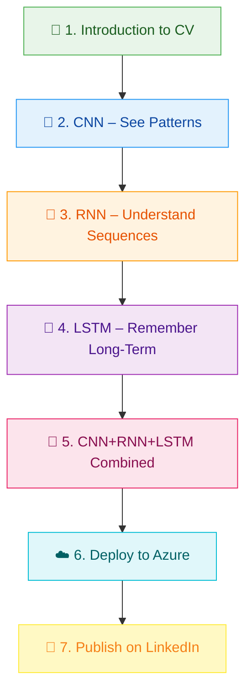
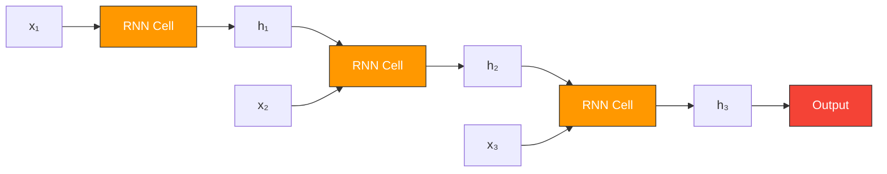
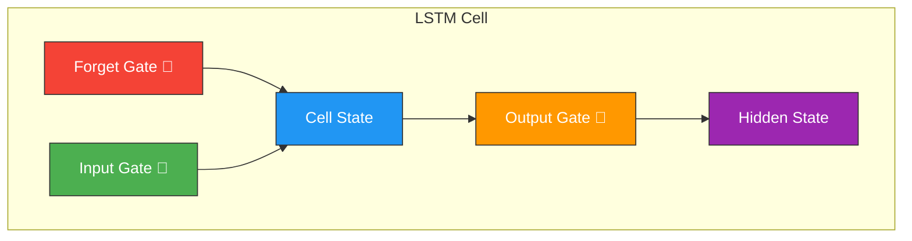
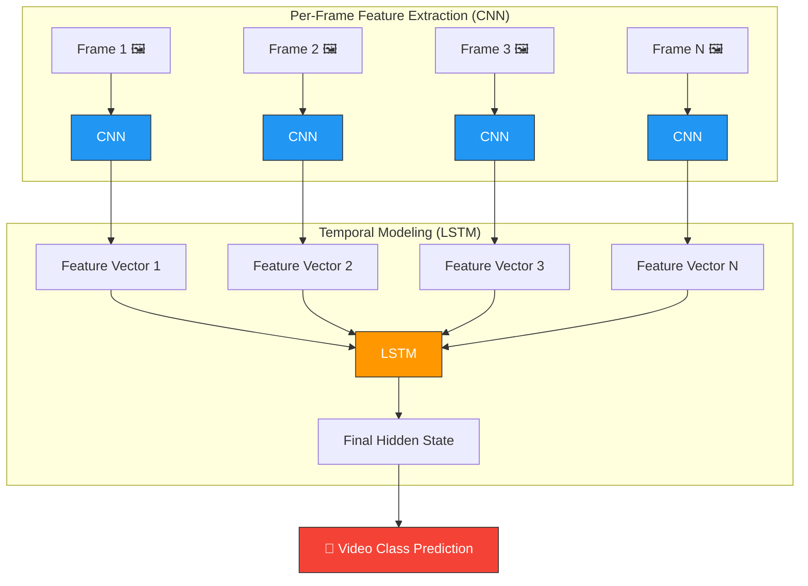
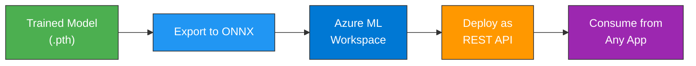

<div align="center">

# 🖥️ Computer Vision — CNN + RNN + LSTM

### A Complete Hands-On Guide for Students & Professionals

[](https://www.python.org/)
[](https://pytorch.org/)
[](LICENSE)
[](docs/06_azure_deployment_guide.md)

*Learn how Convolutional Neural Networks (CNN), Recurrent Neural Networks (RNN), and Long Short-Term Memory (LSTM) networks work — individually and together — then deploy to the cloud.*

</div>

---

## 📑 Table of Contents

| #  | Section | Description |
|----|---------|-------------|
| 1  | [What is Computer Vision?](#-what-is-computer-vision) | Core concepts & real-world applications |
| 2  | [Project Architecture](#-project-architecture) | Repository layout & file map |
| 3  | [Installation & Setup](#-installation--setup-guide) | **Complete step-by-step guide for Windows & macOS/Linux** |
| 4  | [Why Virtual Environment?](#-why-do-we-use-a-virtual-environment-venv) | Understanding venv and why it matters |
| 5  | [Running the Code](#-running-the-code) | How to execute each module |
| 6  | [Learning Path](#-learning-path) | Structured order of study |
| 7  | [CNN Module](#-module-1--cnn--convolutional-neural-network) | Image classification from scratch |
| 8  | [RNN Module](#-module-2--rnn--recurrent-neural-network) | Sequence modeling on image features |
| 9  | [LSTM Module](#-module-3--lstm--long-short-term-memory) | Long-range dependency modeling |
| 10 | [Combined Module](#-module-4--cnn--rnn--lstm-combined) | Video classification pipeline |
| 11 | [Azure Deployment](#-azure--microsoft-foundry-deployment) | Cloud hosting & inference API |
| 12 | [LinkedIn Guide](#-publish-on-linkedin) | Showcase your project professionally |
| 13 | [Troubleshooting](#-troubleshooting) | Common issues and solutions |
| 14 | [FAQ](#-faq) | Common questions answered |
| 15 | [Contributing](#-contributing) | How to contribute |

---

## 🌍 What is Computer Vision?

Computer Vision (CV) is a field of artificial intelligence that enables machines to **interpret and understand visual information** from the world — images, videos, and real-time camera feeds.


### Real-World Applications

| Domain | Application | Models Used |
|--------|------------|-------------|
| 🏥 Healthcare | X-ray / MRI diagnosis | CNN |
| 🚗 Autonomous Vehicles | Object detection & tracking | CNN + RNN |
| 📹 Surveillance | Activity recognition in video | CNN + LSTM |
| 🛒 Retail | Product recognition | CNN |
| 🎮 Gaming / AR | Gesture & pose estimation | CNN + LSTM |
| 📝 OCR | Handwriting recognition | CNN + RNN + LSTM |

---

## 🏗️ Project Architecture

```
computerV/
├── 📄 README.md                  ← You are here
├── 📄 requirements.txt           ← All Python dependencies (libraries needed)
├── 📄 setup.ps1                  ← One-click setup script (Windows PowerShell)
├── 📄 setup.sh                   ← One-click setup script (macOS/Linux Terminal)
├── 📄 .gitignore                 ← Files Git should ignore
│
├── 📂 docs/                      ← Detailed concept guides & tutorials
│   ├── 01_introduction_to_computer_vision.md
│   ├── 02_convolutional_neural_networks.md
│   ├── 03_recurrent_neural_networks.md
│   ├── 04_long_short_term_memory.md
│   ├── 05_cnn_rnn_lstm_combined.md
│   ├── 06_azure_deployment_guide.md
│   ├── 07_linkedin_publishing_guide.md
│   └── 08_run_setup_lean.md
│
├── 📂 src/                       ← All Python source code
│   ├── 📂 01_cnn/
│   │   └── cnn_image_classifier.py    ← CNN model training script
│   ├── 📂 02_rnn/
│   │   └── rnn_sequence_model.py      ← RNN model training script
│   ├── 📂 03_lstm/
│   │   └── lstm_model.py              ← LSTM model training script
│   ├── 📂 04_combined/
│   │   └── cnn_rnn_lstm_combined.py   ← Combined architecture script
│   └── 📂 utils/
│       ├── data_loader.py             ← Dataset loading utilities
│       └── visualization.py           ← Plotting and visualization helpers
│
├── 📂 data/                      ← Datasets (auto-downloaded when you run scripts)
├── 📂 models/                    ← Saved model weights (.pth files)
└── 📂 outputs/                   ← Training plots & metrics (generated during training)
```

---

## 🚀 Installation & Setup Guide

This section provides **complete step-by-step instructions** for both **Windows** and **macOS/Linux** users.

### Prerequisites

Before you begin, make sure you have these installed:

| Software | Version | Download Link | Why You Need It |
|----------|---------|---------------|-----------------|
| **Python** | 3.10 or higher | [python.org/downloads](https://www.python.org/downloads/) | Runs the machine learning code |
| **Git** | Any recent version | [git-scm.com/downloads](https://git-scm.com/downloads) | Downloads the project code |
| **VS Code** (recommended) | Any recent version | [code.visualstudio.com](https://code.visualstudio.com/) | Best code editor for Python |

> 💡 **Tip for Windows users:** When installing Python, make sure to check ✅ **"Add Python to PATH"** during installation!

---

### Step 1: Download the Project

Open your terminal (or PowerShell on Windows) and run:

```bash
git clone https://github.com/EricKart/computerV.git
cd computerV
```

**What this does:**
- `git clone` downloads all the project files from GitHub to your computer
- `cd computerV` moves you into the project folder

---

### Step 2: Run the Setup Script

The setup script automatically creates a virtual environment and installs all required packages.

#### 🪟 Windows (PowerShell)

```powershell
.\setup.ps1
```

> ⚠️ **If you get an error about "execution policy"**, run this first:
> ```powershell
> Set-ExecutionPolicy -Scope Process -ExecutionPolicy Bypass
> ```
> Then try `.\setup.ps1` again.

#### 🍎 macOS / 🐧 Linux (Terminal)

```bash
chmod +x setup.sh
./setup.sh
```

**What the setup script does:**
1. ✅ Creates a `venv/` folder (virtual environment) to isolate project dependencies
2. ✅ Upgrades `pip` (Python's package installer) to the latest version
3. ✅ Installs all required libraries from `requirements.txt` (PyTorch, NumPy, etc.)
4. ✅ Creates necessary folders: `data/`, `models/`, `outputs/`, `logs/`

---

### Step 3: Activate the Virtual Environment

Before running any Python code, you must **activate** the virtual environment:

#### 🪟 Windows (PowerShell)

```powershell
.\venv\Scripts\Activate.ps1
```

You'll see `(venv)` appear at the beginning of your command line, like this:
```
(venv) PS C:\Users\YourName\computerV>
```

#### 🍎 macOS / 🐧 Linux (Terminal)

```bash
source venv/bin/activate
```

You'll see `(venv)` appear at the beginning of your command line, like this:
```
(venv) user@computer:~/computerV$
```

> 💡 **Remember:** You need to activate the virtual environment **every time** you open a new terminal window to work on this project!

---

### Step 4: Verify Installation

Run these commands to make sure everything is set up correctly:

```bash
python --version
```
Expected output: `Python 3.10.x` or higher

```bash
python -c "import torch, torchvision, matplotlib, onnx; print('✅ Environment OK - All packages installed!')"
```
Expected output: `✅ Environment OK - All packages installed!`

---

### Step 5: You're Ready! 🎉

Now you can run any of the training scripts. Start with the CNN module:

```bash
python src/01_cnn/cnn_image_classifier.py
```

---

## 🤔 Why Do We Use a Virtual Environment (venv)?

Understanding **why** we use virtual environments is important for every Python developer.

### The Problem Without Virtual Environments

Imagine you have two Python projects:
- **Project A** needs `numpy version 1.20`
- **Project B** needs `numpy version 1.24`

If you install both globally, they will conflict! Only one version can exist at a time.

### The Solution: Virtual Environments

A **virtual environment** is like a **separate, isolated Python installation** for each project.

```
Your Computer
├── Global Python (system-wide)
│
├── Project A/
│   └── venv/          ← Has its own numpy 1.20
│       └── numpy 1.20
│
└── Project B/
    └── venv/          ← Has its own numpy 1.24
        └── numpy 1.24
```

### Benefits of Using venv

| Benefit | Explanation |
|---------|-------------|
| **🔒 Isolation** | Each project has its own packages — no conflicts |
| **📦 Reproducibility** | Anyone can recreate the exact same environment |
| **🧹 Clean System** | Your global Python stays clean and uncluttered |
| **🔄 Easy Reset** | Delete `venv/` folder and run setup again to start fresh |
| **👥 Team Collaboration** | Everyone on the team uses the same package versions |

### How venv Works in This Project

1. **`setup.sh` / `setup.ps1`** creates the `venv/` folder
2. **`requirements.txt`** lists all packages and their versions
3. **Activating** (`source venv/bin/activate` or `.\venv\Scripts\Activate.ps1`) tells your terminal to use *this project's* Python and packages
4. **Deactivating** (`deactivate`) returns you to global Python

> 💡 **Pro Tip:** The `venv/` folder is listed in `.gitignore` so it's never uploaded to GitHub. Each person creates their own `venv/` using the setup script.

---

## ▶️ Running the Code

### Understanding the Module Scripts

Each script in `src/` is a **complete, runnable program** that:
1. Downloads the CIFAR-10 dataset (10 categories of 32x32 images)
2. Builds a neural network model (CNN, RNN, LSTM, or Combined)
3. Trains the model for several epochs
4. Evaluates accuracy on test data
5. Saves the trained model to `models/`
6. Generates visualization plots in `outputs/`

### Running Each Module

Make sure your virtual environment is activated (you see `(venv)` in your terminal), then:

```bash
# Module 1: CNN (Convolutional Neural Network)
python src/01_cnn/cnn_image_classifier.py

# Module 2: RNN (Recurrent Neural Network)
python src/02_rnn/rnn_sequence_model.py

# Module 3: LSTM (Long Short-Term Memory)
python src/03_lstm/lstm_model.py

# Module 4: Combined CNN + LSTM
python src/04_combined/cnn_rnn_lstm_combined.py
```

### What to Expect When Running

When you run a script, you'll see:
1. **Dataset download** (first time only) — downloads ~170MB of images
2. **Training progress** — shows loss and accuracy for each epoch
3. **Final results** — test accuracy and best model saved

Example output:
```
============================================================
  MODULE 1: CNN IMAGE CLASSIFIER
  Dataset : CIFAR-10  |  Model : CifarCNN
============================================================

Epoch [01/15]  Train Loss: 1.4532  Acc: 47.23%  │  Test Loss: 1.1234  Acc: 60.12%  │  23.5s
Epoch [02/15]  Train Loss: 1.0123  Acc: 63.45%  │  Test Loss: 0.9876  Acc: 65.78%  │  22.1s
...
🏆 Best Test Accuracy: 78.45%
```

### Generated Files

After training, check these folders:

| Folder | Contents |
|--------|----------|
| `outputs/` | Training curves, confusion matrices, sample predictions (PNG images) |
| `models/` | Saved model weights (`.pth` files) and ONNX exports |
| `data/` | Downloaded CIFAR-10 dataset |

---

## 📚 Learning Path

Follow this order for the best learning experience:



| Step | Document | Time | What You'll Learn |
|------|----------|------|-------------------|
| 1 | [Introduction to CV](docs/01_introduction_to_computer_vision.md) | 15 min | Pixels, color spaces, image processing basics |
| 2 | [CNN Deep Dive](docs/02_convolutional_neural_networks.md) | 30 min | Convolutions, pooling, feature maps, architectures |
| 3 | [RNN Deep Dive](docs/03_recurrent_neural_networks.md) | 25 min | Sequential data, hidden states, backprop through time |
| 4 | [LSTM Deep Dive](docs/04_long_short_term_memory.md) | 25 min | Gates, cell state, vanishing gradient solution |
| 5 | [Combined Architecture](docs/05_cnn_rnn_lstm_combined.md) | 30 min | Feature extraction + temporal modeling |
| 6 | [Azure Deployment](docs/06_azure_deployment_guide.md) | 45 min | Model hosting, REST API, Microsoft Foundry |
| 7 | [LinkedIn Guide](docs/07_linkedin_publishing_guide.md) | 15 min | Project showcase, post templates |

---

## 🔲 Module 1 — CNN (Convolutional Neural Network)

> **Goal:** Classify images from the CIFAR-10 dataset into 10 categories.

```mermaid
graph LR
    A["Input Image\n32×32×3"] --> B["Conv Layer 1\n+ ReLU"]
    B --> C["MaxPool"]
    C --> D["Conv Layer 2\n+ ReLU"]
    D --> E["MaxPool"]
    E --> F["Flatten"]
    F --> G["Fully Connected"]
    G --> H["Output\n10 classes"]

    style A fill:#4CAF50,stroke:#333,color:#fff
    style B fill:#2196F3,stroke:#333,color:#fff
    style C fill:#03A9F4,stroke:#333,color:#fff
    style D fill:#2196F3,stroke:#333,color:#fff
    style E fill:#03A9F4,stroke:#333,color:#fff
    style F fill:#FF9800,stroke:#333,color:#fff
    style G fill:#9C27B0,stroke:#333,color:#fff
    style H fill:#F44336,stroke:#333,color:#fff
```



**Key Concepts:**
- **Convolution** — Slides a small filter across the image to detect edges, textures, shapes
- **Pooling** — Reduces spatial dimensions (downsampling) while retaining important features
- **ReLU** — Non-linear activation: `f(x) = max(0, x)`

📂 **Code:** `src/01_cnn/cnn_image_classifier.py`  
📖 **Docs:** [docs/02_convolutional_neural_networks.md](docs/02_convolutional_neural_networks.md)

```bash
python src/01_cnn/cnn_image_classifier.py
```

---

## 🔄 Module 2 — RNN (Recurrent Neural Network)

> **Goal:** Process sequential image features to understand temporal/spatial patterns.



**Key Concepts:**
- **Hidden State** — Memory that carries information from previous time steps
- **Recurrence** — Same weights applied at every time step
- **Backpropagation Through Time (BPTT)** — Training across sequences

📂 **Code:** `src/02_rnn/rnn_sequence_model.py`  
📖 **Docs:** [docs/03_recurrent_neural_networks.md](docs/03_recurrent_neural_networks.md)

```bash
python src/02_rnn/rnn_sequence_model.py
```

---

## 🧠 Module 3 — LSTM (Long Short-Term Memory)

> **Goal:** Solve the vanishing gradient problem and model long-range dependencies.



**Key Concepts:**
- **Forget Gate** — Decides what information to discard from cell state
- **Input Gate** — Decides what new information to store
- **Output Gate** — Decides what to output based on cell state
- **Cell State** — Long-term memory highway

📂 **Code:** `src/03_lstm/lstm_model.py`  
📖 **Docs:** [docs/04_long_short_term_memory.md](docs/04_long_short_term_memory.md)

```bash
python src/03_lstm/lstm_model.py
```

---

## 🔗 Module 4 — CNN + RNN + LSTM Combined

> **Goal:** Build a video classification pipeline — CNN extracts spatial features per frame, LSTM captures temporal patterns across frames.



📂 **Code:** `src/04_combined/cnn_rnn_lstm_combined.py`  
📖 **Docs:** [docs/05_cnn_rnn_lstm_combined.md](docs/05_cnn_rnn_lstm_combined.md)

```bash
python src/04_combined/cnn_rnn_lstm_combined.py
```

---

## ☁️ Azure & Microsoft Foundry Deployment

Take your trained model from local to production in the cloud.



📖 **Full Guide:** [docs/06_azure_deployment_guide.md](docs/06_azure_deployment_guide.md)

---

## 📢 Publish on LinkedIn

Showcase your completed project to recruiters and the tech community.

📖 **Full Guide:** [docs/07_linkedin_publishing_guide.md](docs/07_linkedin_publishing_guide.md)

---

## 🔧 Troubleshooting

### Common Issues and Solutions

| Problem | Cause | Solution |
|---------|-------|----------|
| `python` command not found | Python not installed or not in PATH | Install Python 3.10+ and check "Add to PATH" during installation. Restart your terminal. |
| `ModuleNotFoundError: No module named 'torch'` | Virtual environment not activated | Run `source venv/bin/activate` (Mac/Linux) or `.\venv\Scripts\Activate.ps1` (Windows) |
| PowerShell script execution blocked | Windows security policy | Run `Set-ExecutionPolicy -Scope Process -ExecutionPolicy Bypass` first |
| `pip install` fails with permission error | Trying to install globally | Make sure venv is activated (you should see `(venv)` in your terminal) |
| Training is very slow | Running on CPU | This is normal without a GPU. Reduce `EPOCHS` in the script to speed up. |
| CUDA out of memory | GPU memory full | Reduce `BATCH_SIZE` in the script (e.g., 64 → 32 → 16) |
| macOS: `python3-venv` not found | venv module not installed | Install with `brew install python3` or use the Python installer from python.org |

### Fresh Start

If something is broken and you want to start over:

```bash
# Delete the virtual environment
rm -rf venv          # macOS/Linux
rmdir /s /q venv     # Windows

# Run setup again
./setup.sh           # macOS/Linux
.\setup.ps1          # Windows
```

---

## ❓ FAQ

<details>
<summary><strong>Q: Do I need a GPU?</strong></summary>
No. All scripts detect whether a GPU is available and fall back to CPU. Training will be slower on CPU but fully functional. The CIFAR-10 dataset is small enough for CPU training.
</details>

<details>
<summary><strong>Q: Which Python version should I use?</strong></summary>
Python 3.10 or later. We recommend 3.11 for best compatibility.
</details>

<details>
<summary><strong>Q: The setup script fails — what do I do?</strong></summary>

1. Make sure `python` is in your PATH: `python --version`
2. On Windows, you may need to allow script execution: `Set-ExecutionPolicy -Scope CurrentUser RemoteSigned`
3. On Linux/Mac, ensure you have `python3-venv`: `sudo apt install python3-venv` (Ubuntu/Debian)
</details>

<details>
<summary><strong>Q: Can I use TensorFlow instead of PyTorch?</strong></summary>
This project uses PyTorch throughout. The concepts are framework-agnostic — once you understand them here, translating to TensorFlow/Keras is straightforward.
</details>

<details>
<summary><strong>Q: What is the `venv/` folder and why is it so large?</strong></summary>
The `venv/` folder contains your project's virtual environment with all installed packages (PyTorch, NumPy, etc.). It can be 2-5 GB depending on your system. This is normal! Each student creates their own `venv/` locally — it's never uploaded to GitHub.
</details>

<details>
<summary><strong>Q: How do I update to the latest code from the instructor?</strong></summary>

```bash
# Pull the latest changes (--ff-only prevents merge commits)
git pull --ff-only

# Re-run setup to install any new dependencies
./setup.sh           # macOS/Linux
.\setup.ps1          # Windows
```

> 💡 If `git pull` fails, you may have local changes. Run `git stash` first to save your changes, then `git pull --ff-only`, then `git stash pop` to restore your changes.
</details>

---

## 🤝 Contributing

1. Fork the repository
2. Create a feature branch: `git checkout -b feature/amazing-addition`
3. Commit your changes: `git commit -m 'Add amazing addition'`
4. Push to the branch: `git push origin feature/amazing-addition`
5. Open a Pull Request

---

## 📜 License

This project is licensed under the **MIT License** — see the [LICENSE](LICENSE) file for details.

---

<div align="center">

**Built with ❤️ for the student community**

*Star ⭐ this repo if you find it helpful!*

</div>
