# 📖 Chapter 1 — Introduction to Computer Vision

<div align="center">

*"Computer Vision is the science of making machines see, understand, and interpret visual data."*

</div>

---

## 📑 Table of Contents

1. [What is Computer Vision?](#-what-is-computer-vision)
2. [How Humans vs Machines See](#-how-humans-vs-machines-see)
3. [Digital Images — The Foundation](#-digital-images--the-foundation)
4. [Color Spaces](#-color-spaces)
5. [Image Processing Pipeline](#-image-processing-pipeline)
6. [Key Tasks in Computer Vision](#-key-tasks-in-computer-vision)
7. [Deep Learning Revolution](#-deep-learning-revolution)
8. [Why CNN + RNN + LSTM?](#-why-cnn--rnn--lstm)
9. [Industry Applications](#-industry-applications)

---

## 🌍 What is Computer Vision?

Computer Vision (CV) is a subfield of **Artificial Intelligence** that trains computers to interpret and understand visual information from the world. Just as humans use their eyes and brain to understand what they see, CV systems use cameras and algorithms to interpret images and videos.

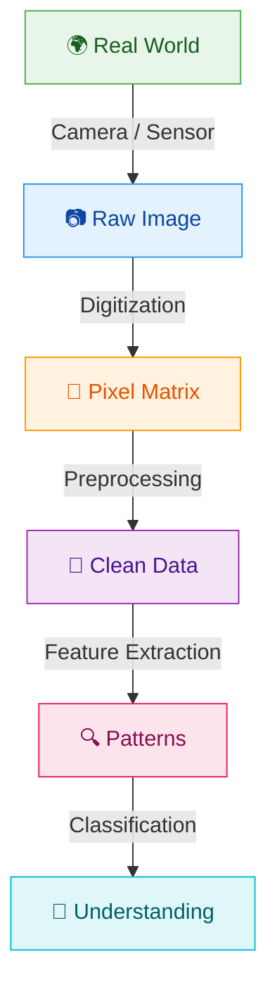

### Key Definition

> **Computer Vision** = Teaching machines to extract meaningful information from visual inputs (images, videos, 3D scans) and make decisions based on that information.

---

## 👁️ How Humans vs Machines See

| Aspect | Human Vision | Machine Vision |
|--------|-------------|----------------|
| **Sensor** | Eyes (retina) | Camera (CCD/CMOS sensor) |
| **Processing** | Brain (visual cortex) | GPU/CPU running algorithms |
| **Speed** | ~100ms for recognition | ~10ms for classification |
| **Interpretation** | Intuitive, context-aware | Pattern-matching, data-driven |
| **Weakness** | Optical illusions, fatigue | Poor generalization to unseen data |
| **Strength** | Handles novel situations | Consistency, speed, scale |

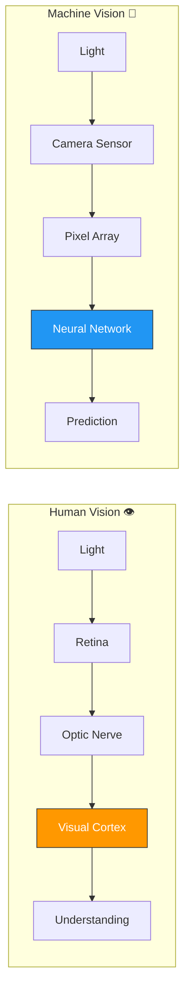

---

## 🔢 Digital Images — The Foundation

### What is a Digital Image?

A digital image is simply a **2D matrix of numbers** (pixels). Each number represents the brightness or color intensity at that point.

### Grayscale Image

A grayscale image has one value per pixel (0 = black, 255 = white):

```
Grayscale 5×5 example:
┌─────┬─────┬─────┬─────┬─────┐
│  0  │  50 │ 100 │ 150 │ 200 │
├─────┼─────┼─────┼─────┼─────┤
│  25 │  75 │ 125 │ 175 │ 225 │
├─────┼─────┼─────┼─────┼─────┤
│  50 │ 100 │ 150 │ 200 │ 250 │
├─────┼─────┼─────┼─────┼─────┤
│  75 │ 125 │ 175 │ 225 │ 255 │
├─────┼─────┼─────┼─────┼─────┤
│ 100 │ 150 │ 200 │ 250 │ 255 │
└─────┴─────┴─────┴─────┴─────┘
      ↑ each cell = 1 pixel
```

### Color Image (RGB)

A color image has **3 channels**: Red, Green, Blue. Each pixel is a triplet `(R, G, B)`.

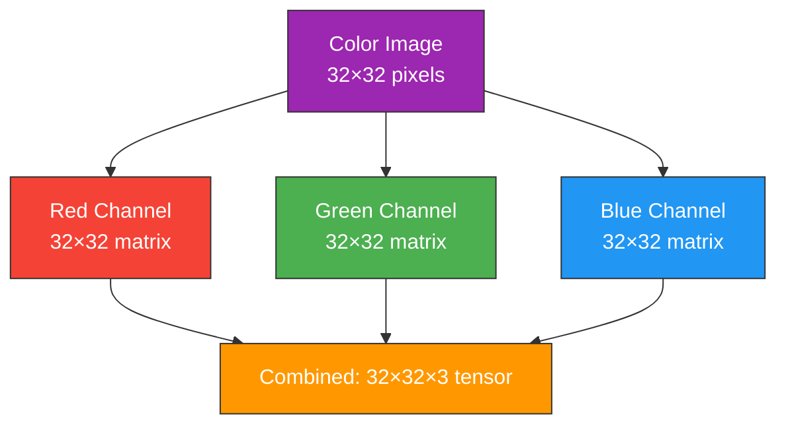

### Image Dimensions in Deep Learning

```
                    Width
              ◄──────────────►
          ┌───────────────────────┐  ▲
          │                       │  │
          │    H × W × C         │  │ Height
          │                       │  │
          │  (Height × Width ×    │  │
          │   Channels)           │  │
          └───────────────────────┘  ▼

Example:  CIFAR-10 image = 32 × 32 × 3
          = 32 pixels tall
          × 32 pixels wide
          × 3 color channels (RGB)
          = 3,072 total values per image
```

---

## 🎨 Color Spaces

Different ways to represent color information:

| Color Space | Channels | Use Case |
|-------------|----------|----------|
| **RGB** | Red, Green, Blue | Default for cameras/screens |
| **Grayscale** | Single intensity | Simplifies processing |
| **HSV** | Hue, Saturation, Value | Color-based segmentation |
| **LAB** | Lightness, A, B | Perceptually uniform |
| **YCbCr** | Luminance, Chrominance | Video compression |

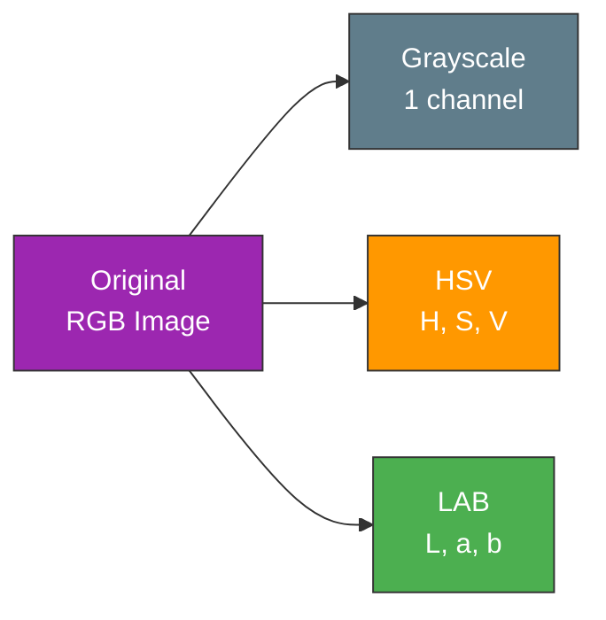

---

## 🔄 Image Processing Pipeline

Before feeding images to a neural network, we typically preprocess them:

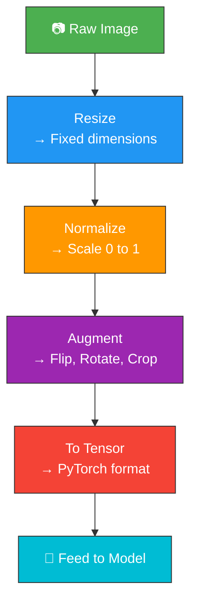

### Why Each Step Matters

| Step | Why | Example |
|------|-----|---------|
| **Resize** | Neural networks need fixed-size inputs | 1920×1080 → 32×32 |
| **Normalize** | Scale pixel values for faster convergence | [0, 255] → [0.0, 1.0] |
| **Augment** | Prevent overfitting by creating variations | Horizontal flip, rotation |
| **To Tensor** | Convert NumPy array to PyTorch tensor | `(H, W, C)` → `(C, H, W)` |

---

## 🎯 Key Tasks in Computer Vision

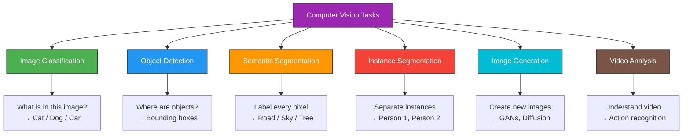

### Task Comparison

```
┌─────────────────────────────────────────────────────┐
│  Input Image       Classification   Detection       │
│  ┌──────────┐     ┌──────────┐    ┌──────────┐     │
│  │  🐱 🐕   │     │          │    │ ┌──┐ ┌──┐│     │
│  │          │  →  │  "Cat"   │    │ │🐱│ │🐕││     │
│  │          │     │          │    │ └──┘ └──┘│     │
│  └──────────┘     └──────────┘    └──────────┘     │
│                                                     │
│  Segmentation      Instance Seg.                    │
│  ┌──────────┐     ┌──────────┐                      │
│  │▓▓▓▓░░░░░░│     │▓▓▓▓▒▒▒▒▒▒│                     │
│  │▓▓▓▓░░░░░░│     │▓▓▓▓▒▒▒▒▒▒│                     │
│  │▓▓▓▓░░░░░░│     │▓▓▓▓▒▒▒▒▒▒│                     │
│  └──────────┘     └──────────┘                      │
│  ▓=cat ░=dog      ▓=cat1 ▒=dog1                    │
└─────────────────────────────────────────────────────┘
```

---

## 🚀 Deep Learning Revolution

### Before Deep Learning (Traditional CV)

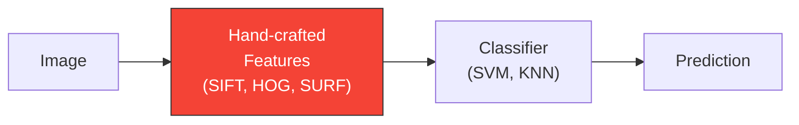

**Problem:** Engineers had to manually design feature extractors — time-consuming and limited.

### After Deep Learning (Modern CV)

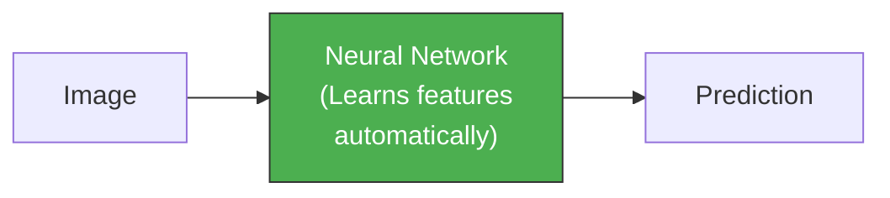

**Advantage:** The network learns optimal features directly from data!

### Key Milestones

| Year | Milestone | Impact |
|------|-----------|--------|
| 2012 | AlexNet wins ImageNet | CNN era begins |
| 2014 | VGGNet, GoogLeNet | Deeper networks |
| 2015 | ResNet | Skip connections, 152 layers |
| 2017 | Transformers | Attention mechanism for NLP |
| 2020 | Vision Transformers (ViT) | Transformers for vision |
| 2022 | Stable Diffusion | Image generation revolution |

---

## 🧠 Why CNN + RNN + LSTM?

Each architecture solves a specific problem. Together, they handle complex visual tasks:

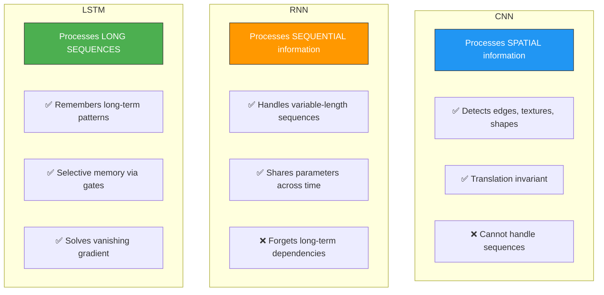

### When to Use Each

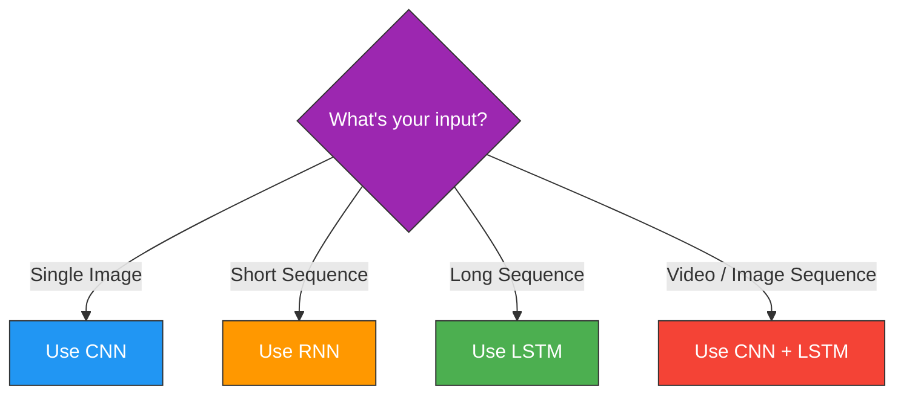

---

## 🏢 Industry Applications

### Healthcare 🏥


### Autonomous Driving 🚗

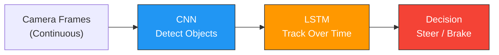

### Video Surveillance 📹


---

## 🔑 Key Takeaways

1. **Computer Vision** enables machines to understand visual data
2. **Digital images** are matrices of numbers — pixels with intensity values
3. **Preprocessing** (resize, normalize, augment) is critical before training
4. **CNNs** excel at spatial pattern recognition (edges, textures, objects)
5. **RNNs** handle sequential data but struggle with long sequences
6. **LSTMs** solve the long-term memory problem with gating mechanisms
7. **Combining CNN + LSTM** enables powerful video understanding

---

<div align="center">

**Next Chapter →** [CNN — Convolutional Neural Networks](02_convolutional_neural_networks.md)

</div>
