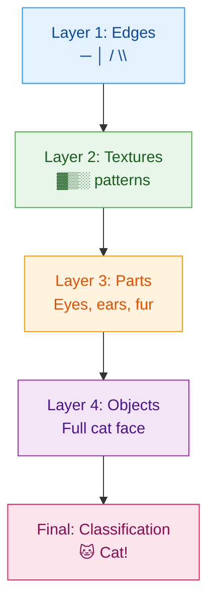
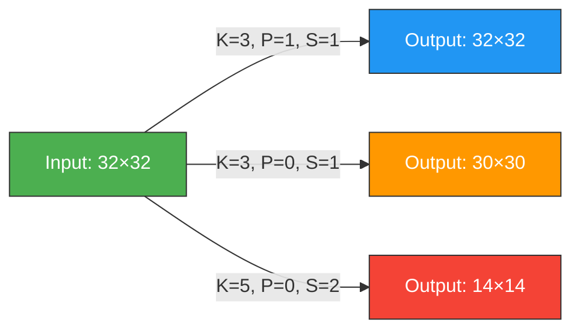
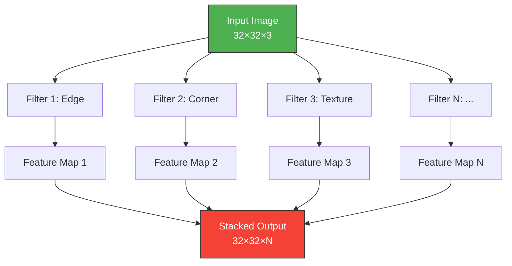
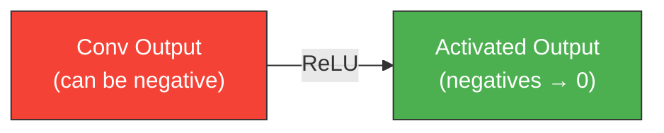
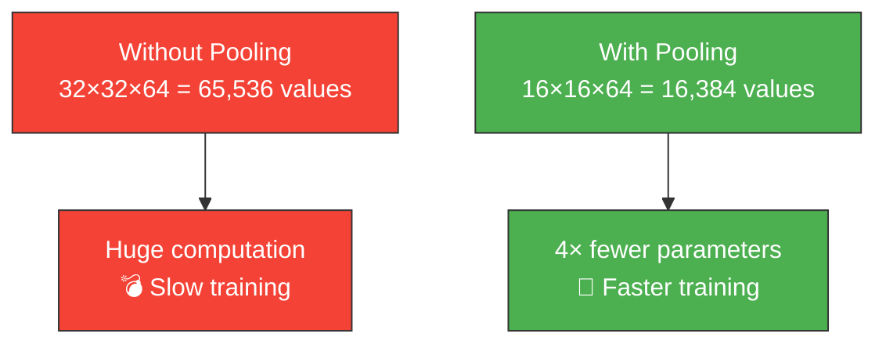
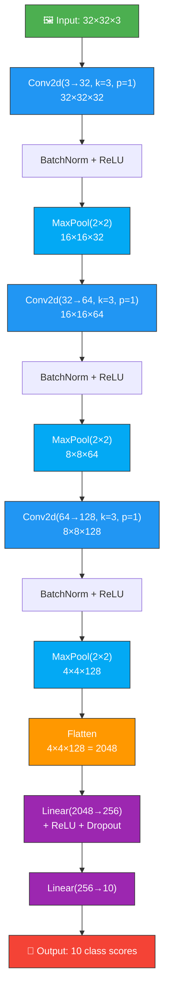
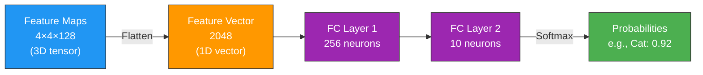
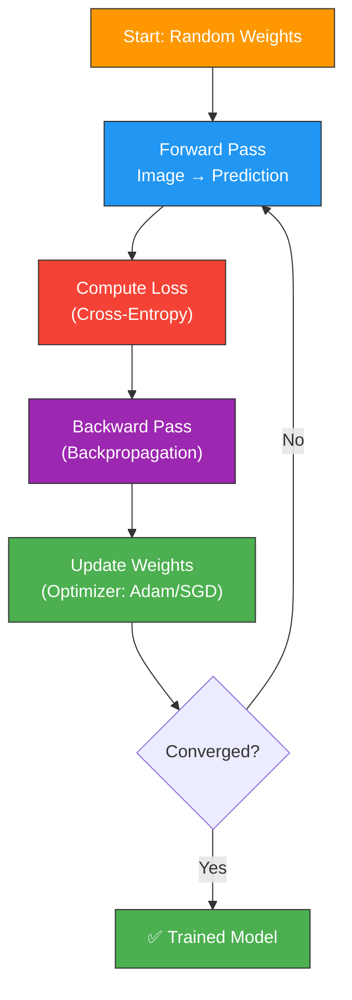
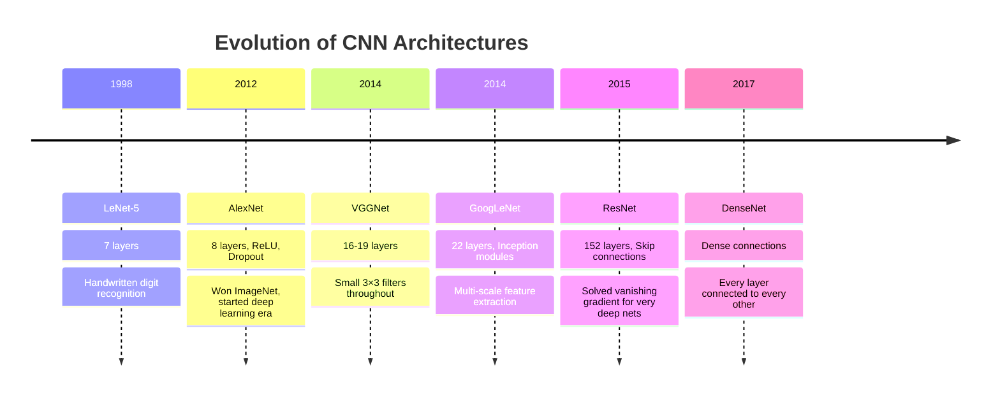

# 🔲 Chapter 2 — Convolutional Neural Networks (CNN)

<div align="center">

*"CNNs are the eyes of deep learning — they see patterns humans can't."*

</div>

---

## 📑 Table of Contents

1. [What is a CNN?](#-what-is-a-cnn)
2. [Intuition — How CNNs Think](#-intuition--how-cnns-think)
3. [The Convolution Operation](#-the-convolution-operation)
4. [Feature Maps & Filters](#-feature-maps--filters)
5. [Activation Functions](#-activation-functions)
6. [Pooling Layers](#-pooling-layers)
7. [CNN Architecture — Layer by Layer](#-cnn-architecture--layer-by-layer)
8. [Flattening & Fully Connected Layers](#-flattening--fully-connected-layers)
9. [Training a CNN](#-training-a-cnn)
10. [Famous CNN Architectures](#-famous-cnn-architectures)
11. [Our Implementation](#-our-implementation)
12. [Common Pitfalls](#-common-pitfalls)

---

## 🧠 What is a CNN?

A **Convolutional Neural Network (CNN)** is a specialized neural network designed to process **grid-structured data** like images. It automatically learns hierarchical features — from simple edges to complex objects.

```mermaid
graph LR
    A["Input\n32×32×3"] --> B["Conv + ReLU"]
    B --> C["Pool"]
    C --> D["Conv + ReLU"]
    D --> E["Pool"]
    E --> F["Flatten"]
    F --> G["FC Layer"]
    G --> H["Softmax"]
    H --> I["Output\n10 classes"]

    style A fill:#4CAF50,stroke:#333,color:#fff
    style B fill:#2196F3,stroke:#333,color:#fff
    style C fill:#03A9F4,stroke:#333,color:#fff
    style D fill:#2196F3,stroke:#333,color:#fff
    style E fill:#03A9F4,stroke:#333,color:#fff
    style F fill:#FF9800,stroke:#333,color:#fff
    style G fill:#9C27B0,stroke:#333,color:#fff
    style H fill:#E91E63,stroke:#333,color:#fff
    style I fill:#F44336,stroke:#333,color:#fff
```



### Why Not Use a Regular Neural Network for Images?

| Regular NN | CNN |
|-----------|-----|
| Treats image as flat vector (32×32×3 = 3072 inputs) | Preserves spatial structure |
| Loses spatial relationships between pixels | Learns local patterns (edges, textures) |
| Too many parameters → overfitting | Parameter sharing → efficient |
| Not translation invariant | Detects patterns anywhere in image |

---

## 💡 Intuition — How CNNs Think

Imagine looking at a photo of a cat. Your brain doesn't analyze every pixel individually — it recognizes:



**CNNs learn in the same hierarchical way!** Early layers detect simple features (edges), deeper layers combine them into complex representations (faces, objects).

---

## 🔄 The Convolution Operation

### What is Convolution?

Convolution is sliding a small matrix (called a **filter** or **kernel**) across an image and computing the dot product at each position.

### Step-by-Step Animation

```
Step 1: Filter at position (0,0)

Image (5×5):                    Filter (3×3):
┌───┬───┬───┬───┬───┐          ┌───┬───┬───┐
│ 1 │ 0 │ 1 │ 0 │ 1 │          │ 1 │ 0 │ 1 │
├───┼───┼───┼───┼───┤          ├───┼───┼───┤
│ 0 │ 1 │ 0 │ 1 │ 0 │     ×    │ 0 │ 1 │ 0 │
├───┼───┼───┼───┼───┤          ├───┼───┼───┤
│ 1 │ 0 │ 1 │ 0 │ 1 │          │ 1 │ 0 │ 1 │
├───┼───┼───┼───┼───┤          └───┴───┴───┘
│ 0 │ 1 │ 0 │ 1 │ 0 │
├───┼───┼───┼───┼───┤
│ 1 │ 0 │ 1 │ 0 │ 1 │
└───┴───┴───┴───┴───┘

Computation at (0,0):
(1×1) + (0×0) + (1×1) + (0×0) + (1×1) + (0×0) + (1×1) + (0×0) + (1×1) = 4

Step 2: Slide filter right by 1 (stride=1)

┌───┬───┬───┬───┬───┐
│   │ 0 │ 1 │ 0 │   │         Result at (0,1):
│   ├───┼───┼───┤   │         (0×1)+(1×0)+(0×1)+(1×0)+(0×1)+(1×0)+(0×1)+(1×0)+(0×1) = 0
│   │ 1 │ 0 │ 1 │   │
│   ├───┼───┼───┤   │
│   │ 0 │ 1 │ 0 │   │
└───┴───┴───┴───┴───┘

... continue sliding across entire image
```

### Output Size Formula

$$\text{Output Size} = \frac{W - K + 2P}{S} + 1$$

Where:
- $W$ = Input width (or height)
- $K$ = Kernel/filter size
- $P$ = Padding
- $S$ = Stride

**Example:** Input = 32×32, Kernel = 3×3, Padding = 1, Stride = 1
$$\frac{32 - 3 + 2(1)}{1} + 1 = 32$$



---

## 🗺️ Feature Maps & Filters

### What Does a Filter Detect?

Different filters detect different patterns:

```
Edge Detection       Horizontal Edge     Sharpen
(Vertical)
┌────┬────┬────┐    ┌────┬────┬────┐    ┌────┬────┬────┐
│ -1 │  0 │  1 │    │ -1 │ -1 │ -1 │    │  0 │ -1 │  0 │
├────┼────┼────┤    ├────┼────┼────┤    ├────┼────┼────┤
│ -1 │  0 │  1 │    │  0 │  0 │  0 │    │ -1 │  5 │ -1 │
├────┼────┼────┤    ├────┼────┼────┤    ├────┼────┼────┤
│ -1 │  0 │  1 │    │  1 │  1 │  1 │    │  0 │ -1 │  0 │
└────┴────┴────┘    └────┴────┴────┘    └────┴────┴────┘
```

### Multiple Filters = Multiple Feature Maps



A conv layer with **64 filters** produces a **64-channel output** (64 feature maps).

---

## ⚡ Activation Functions

After convolution, we apply a non-linear activation function. Without non-linearity, stacking layers would be useless (linear stack = just one linear layer).

### ReLU (Rectified Linear Unit) — The Most Common

$$f(x) = \max(0, x)$$

```
Input:    [-2, -1, 0, 1, 2, 3]
ReLU:     [ 0,  0, 0, 1, 2, 3]

         Output
         │     ╱
         │    ╱
         │   ╱
    ─────┼──╱────── Input
         │╱
         │
```

### Why ReLU?

| Property | Benefit |
|----------|---------|
| **Simple** | Just `max(0, x)` — very fast to compute |
| **Sparse activation** | Many neurons output 0 → efficient |
| **Non-saturating** | Positive values pass through → no vanishing gradient |



---

## 🏊 Pooling Layers

Pooling **reduces spatial dimensions** while keeping the most important information.

### Max Pooling (Most Common)

Takes the maximum value in each window:

```
Input (4×4):                   Max Pool (2×2, stride 2):
┌────┬────┬────┬────┐         ┌────┬────┐
│  1 │  3 │  5 │  2 │         │  6 │  8 │
├────┼────┼────┼────┤    →    ├────┼────┤
│  6 │  2 │  8 │  1 │         │  9 │  7 │
├────┼────┼────┼────┤         └────┴────┘
│  4 │  9 │  3 │  5 │
├────┼────┼────┼────┤         Output: 2×2
│  7 │  1 │  6 │  7 │         (75% reduction!)
└────┴────┴────┴────┘

Step by step:
  Window [1,3,6,2] → max = 6
  Window [5,2,8,1] → max = 8
  Window [4,9,7,1] → max = 9
  Window [3,5,6,7] → max = 7
```

### Average Pooling

Takes the mean value in each window:

```
Window [1,3,6,2] → avg = 3.0
Window [5,2,8,1] → avg = 4.0
```

### Why Pool?



| Benefit | Explanation |
|---------|-------------|
| **Reduces computation** | Fewer parameters in later layers |
| **Translation invariance** | Small shifts don't change the output |
| **Prevents overfitting** | Less data = less memorization |

---

## 🏗️ CNN Architecture — Layer by Layer

Here's the complete data flow through our CNN:



### Dimension Tracking Table

| Layer | Operation | Input Size | Output Size | Parameters |
|-------|-----------|-----------|-------------|------------|
| 1 | Conv2d(3→32, k=3, p=1) | 32×32×3 | 32×32×32 | (3×3×3)×32 + 32 = 896 |
| 2 | MaxPool(2×2) | 32×32×32 | 16×16×32 | 0 |
| 3 | Conv2d(32→64, k=3, p=1) | 16×16×32 | 16×16×64 | (3×3×32)×64 + 64 = 18,496 |
| 4 | MaxPool(2×2) | 16×16×64 | 8×8×64 | 0 |
| 5 | Conv2d(64→128, k=3, p=1) | 8×8×64 | 8×8×128 | (3×3×64)×128 + 128 = 73,856 |
| 6 | MaxPool(2×2) | 8×8×128 | 4×4×128 | 0 |
| 7 | Flatten | 4×4×128 | 2048 | 0 |
| 8 | Linear(2048→256) | 2048 | 256 | 2048×256 + 256 = 524,544 |
| 9 | Linear(256→10) | 256 | 10 | 256×10 + 10 = 2,570 |
| **Total** | | | | **620,362** |

---

## 📐 Flattening & Fully Connected Layers

After the convolutional layers extract features, we need to classify them.



### Dropout — Regularization Technique

During training, randomly "drops" neurons (sets to zero) to prevent overfitting:

```
Without Dropout:           With Dropout (p=0.5):
○─○─○─○─○                 ○─○─╳─○─╳
│ │ │ │ │                  │ │   │
○─○─○─○─○                 ○─╳─○─╳─○
│ │ │ │ │                  │   │   │
○─○─○─○─○                 ○─○─╳─○─○

All neurons active         ~50% randomly dropped
→ May memorize data        → Forces robust features
```

---

## 📈 Training a CNN



### Loss Function: Cross-Entropy

$$L = -\sum_{i=1}^{C} y_i \log(\hat{y}_i)$$

Where:
- $C$ = number of classes (10 for CIFAR-10)
- $y_i$ = true label (one-hot: [0, 0, 1, 0, ...])
- $\hat{y}_i$ = predicted probability

### Optimizer: Adam

Combines the best of SGD + Momentum + RMSprop:
- **Adaptive learning rates** per parameter
- **Momentum** for faster convergence
- Default choice for most deep learning tasks

---

## 🏆 Famous CNN Architectures



### Architecture Comparison

| Architecture | Year | Layers | Parameters | Top-5 Error |
|-------------|------|--------|------------|-------------|
| LeNet-5 | 1998 | 7 | 60K | — |
| AlexNet | 2012 | 8 | 60M | 16.4% |
| VGG-16 | 2014 | 16 | 138M | 7.3% |
| GoogLeNet | 2014 | 22 | 7M | 6.7% |
| ResNet-152 | 2015 | 152 | 60M | 3.6% |

---

## 💻 Our Implementation

Our CNN classifier in `src/01_cnn/cnn_image_classifier.py`:

- **Dataset:** CIFAR-10 (60,000 images, 10 classes)
- **Architecture:** 3 Conv blocks + 2 FC layers
- **Training:** 20 epochs with Adam optimizer
- **Output:** Accuracy metrics + prediction visualizations

### CIFAR-10 Classes

```
┌───────────┬───────────┬───────────┬───────────┬───────────┐
│ ✈️ Airplane│ 🚗 Auto   │ 🐦 Bird   │ 🐱 Cat    │ 🦌 Deer   │
├───────────┼───────────┼───────────┼───────────┼───────────┤
│ 🐕 Dog    │ 🐸 Frog   │ 🐴 Horse  │ 🚢 Ship   │ 🚛 Truck  │
└───────────┴───────────┴───────────┴───────────┴───────────┘
```

### Run It

```bash
python src/01_cnn/cnn_image_classifier.py
```

---

## ⚠️ Common Pitfalls

| Pitfall | Solution |
|---------|----------|
| **Overfitting** | Add Dropout, data augmentation, early stopping |
| **Vanishing gradients** | Use BatchNorm, ReLU, skip connections |
| **Wrong input size** | Track dimensions carefully through each layer |
| **Too few filters** | Start with 32→64→128 pattern |
| **No normalization** | Always normalize input images to [0, 1] |

---

<div align="center">

**← Previous:** [Introduction to CV](01_introduction_to_computer_vision.md) | **Next →** [RNN — Recurrent Neural Networks](03_recurrent_neural_networks.md)

</div>
