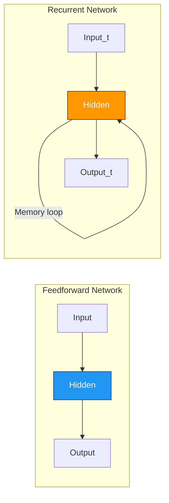
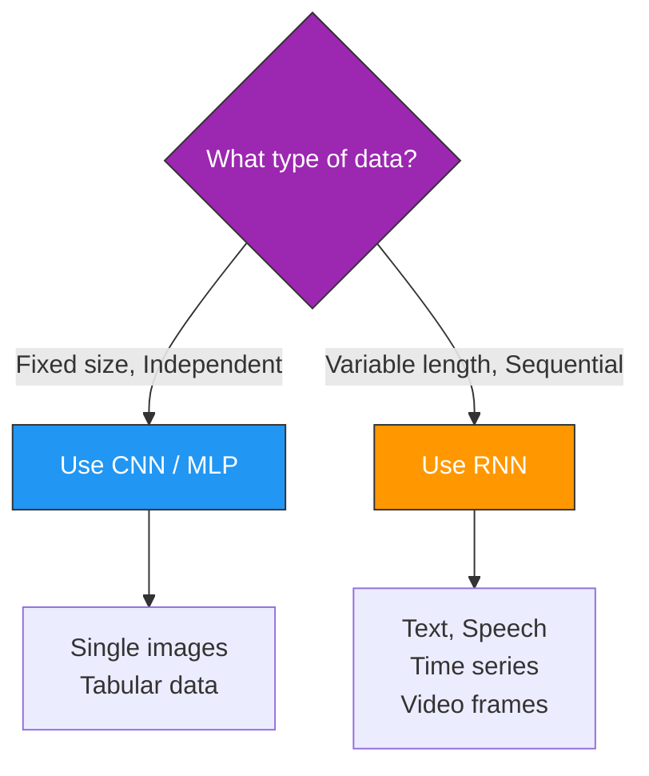
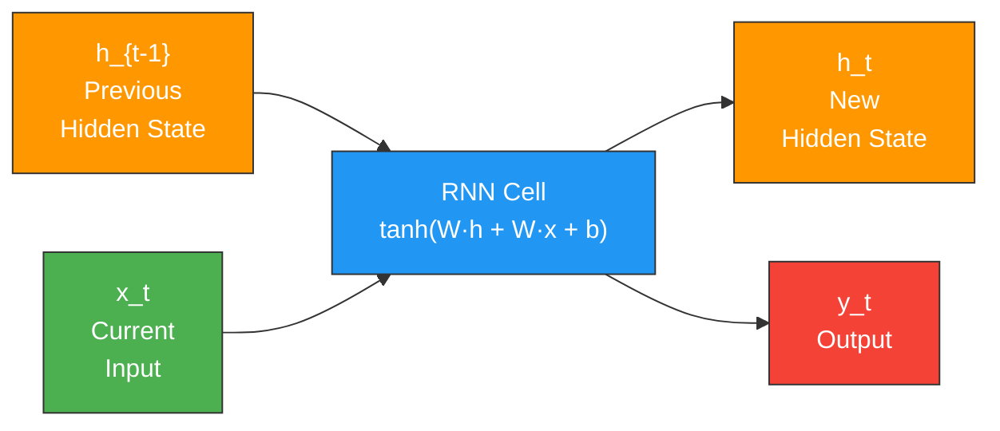
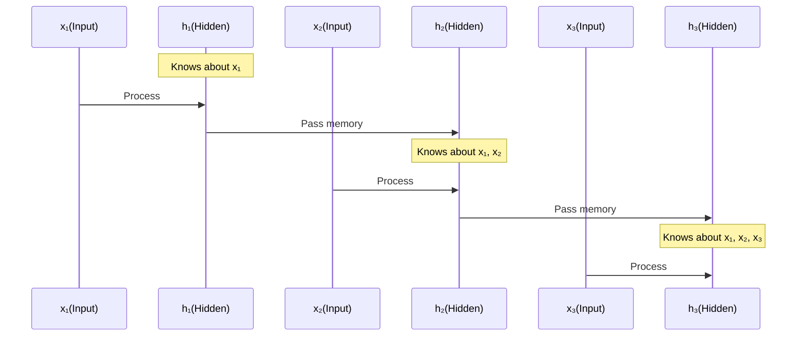
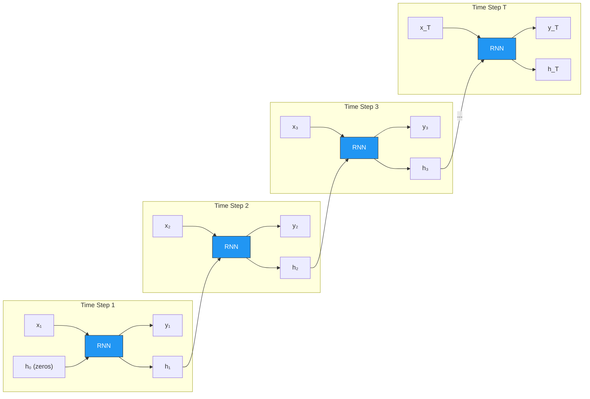
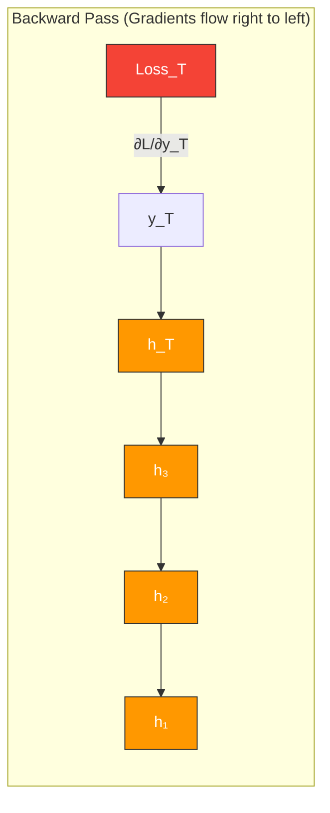
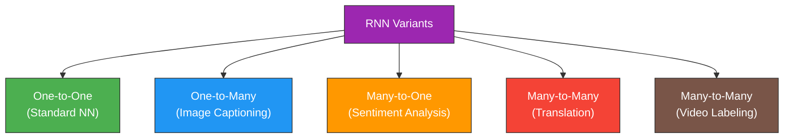
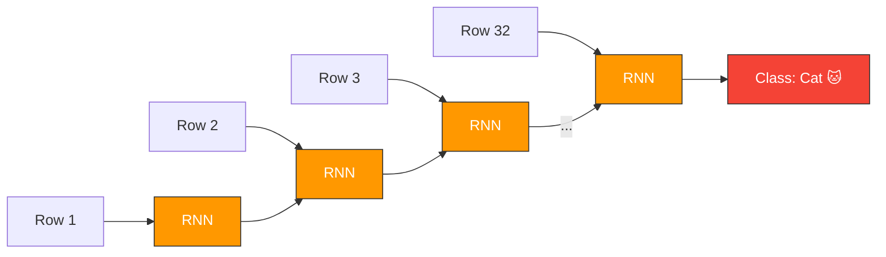
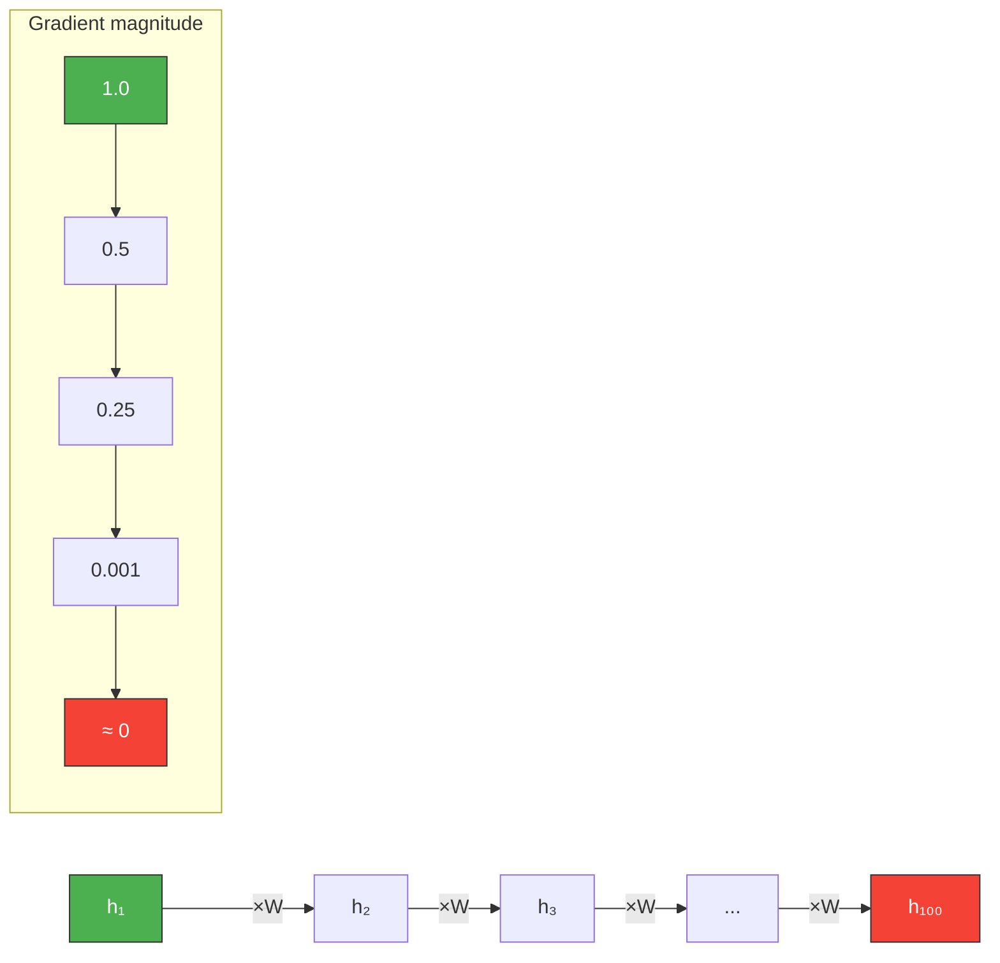
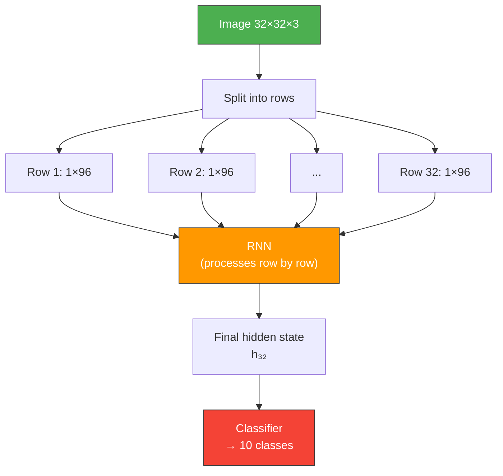

# 🔄 Chapter 3 — Recurrent Neural Networks (RNN)

<div align="center">

*"RNNs give neural networks the ability to remember — they process sequences one step at a time, carrying memory forward."*

</div>

---

## 📑 Table of Contents

1. [What is an RNN?](#-what-is-an-rnn)
2. [Why Do We Need RNNs?](#-why-do-we-need-rnns)
3. [RNN Architecture — Step by Step](#-rnn-architecture--step-by-step)
4. [The Hidden State — Memory of the Network](#-the-hidden-state--memory-of-the-network)
5. [Mathematical Foundation](#-mathematical-foundation)
6. [Unrolling an RNN Through Time](#-unrolling-an-rnn-through-time)
7. [Backpropagation Through Time (BPTT)](#-backpropagation-through-time-bptt)
8. [Types of RNN Architectures](#-types-of-rnn-architectures)
9. [The Vanishing Gradient Problem](#-the-vanishing-gradient-problem)
10. [RNN for Computer Vision](#-rnn-for-computer-vision)
11. [Our Implementation](#-our-implementation)

---

## 🧠 What is an RNN?

A **Recurrent Neural Network (RNN)** is a neural network designed to process **sequential data** — data where order matters. Unlike feedforward networks that process each input independently, RNNs maintain a **hidden state** that carries information from previous steps.



### Key Insight

> **RNNs process data step by step, remembering what they've seen before.** Each output depends on both the current input AND all previous inputs.

---

## ❓ Why Do We Need RNNs?

Regular neural networks (CNNs, MLPs) have a fundamental limitation: **they can't handle variable-length sequences or remember past context.**



### Sequential Data Examples

| Data Type | Why Order Matters |
|-----------|-------------------|
| **Text** | "Dog bites man" ≠ "Man bites dog" |
| **Speech** | Sound waveform is a time sequence |
| **Video** | Frames in order tell a story |
| **Stock Prices** | Yesterday's price affects today's analysis |
| **Image Rows** | Processing an image row-by-row as a sequence |

---

## 🏗️ RNN Architecture — Step by Step

### The Single RNN Cell

```
                    ┌───────────────────────┐
                    │                       │
     h_{t-1} ─────►│     RNN Cell          ├─────► h_t
                    │                       │
     x_t ─────────►│  h_t = tanh(W_hh·h_{t-1} + W_xh·x_t + b) │
                    │                       │
                    └───────────┬───────────┘
                                │
                                ▼
                             y_t (output)
```



**Three key components:**
1. **Input `x_t`** — Current data at time step `t`
2. **Hidden state `h_t`** — Network's memory, passed to next step
3. **Output `y_t`** — Prediction at the current step

---

## 💾 The Hidden State — Memory of the Network

The hidden state is the RNN's memory. It accumulates information from all previous inputs in the sequence.



### Hidden State Analogy

Think of reading a book:

```
Page 1: "Harry received a letter."
  → Your brain remembers: [Harry, letter]

Page 2: "He went to a magic school."
  → Your brain remembers: [Harry, letter, magic school]

Page 3: "He learned to fly on a broom."
  → Your brain remembers: [Harry, magic school, flying, broom]

Your brain doesn't re-read the entire book at each page.
It carries forward a SUMMARY (= hidden state).
```

---

## 📐 Mathematical Foundation

### Core Equations

At each time step $t$:

$$h_t = \tanh(W_{hh} \cdot h_{t-1} + W_{xh} \cdot x_t + b_h)$$

$$y_t = W_{hy} \cdot h_t + b_y$$

Where:
| Symbol | Meaning | Shape |
|--------|---------|-------|
| $x_t$ | Input at time $t$ | `(input_size,)` |
| $h_t$ | Hidden state at time $t$ | `(hidden_size,)` |
| $W_{xh}$ | Input-to-hidden weights | `(hidden_size, input_size)` |
| $W_{hh}$ | Hidden-to-hidden weights | `(hidden_size, hidden_size)` |
| $W_{hy}$ | Hidden-to-output weights | `(output_size, hidden_size)` |
| $b_h, b_y$ | Bias terms | `(hidden_size,)`, `(output_size,)` |
| $\tanh$ | Activation function | Squashes values to [-1, 1] |

### Why tanh?

$$\tanh(x) = \frac{e^x - e^{-x}}{e^x + e^{-x}}$$

```
         1 ─────────────────╱─────
                          ╱
         0 ─────────────╱─────────
                      ╱
        -1 ─────────╱─────────────

Output range: [-1, 1]
• Centers outputs around 0
• Helps with gradient flow
```

---

## ⏰ Unrolling an RNN Through Time

An RNN can be "unrolled" to visualize how information flows across time steps:



**Key Point:** All RNN cells share the SAME weights ($W_{xh}$, $W_{hh}$, $W_{hy}$). This is called **weight sharing** — it allows the network to generalize across time.

---

## 🔙 Backpropagation Through Time (BPTT)

Training an RNN requires propagating gradients **backward through every time step:**



### The Problem with BPTT

At each backward step, gradients are **multiplied** by the weight matrix $W_{hh}$:

$$\frac{\partial h_t}{\partial h_{t-1}} = W_{hh} \cdot \text{diag}(\tanh'(z))$$

After $T$ steps:

$$\frac{\partial h_T}{\partial h_1} = \prod_{t=2}^{T} W_{hh} \cdot \text{diag}(\tanh'(z_t))$$

If $|W_{hh}| < 1$: gradients **vanish** (shrink to zero)  
If $|W_{hh}| > 1$: gradients **explode** (grow unbounded)

This is the **vanishing/exploding gradient problem** — solved by LSTM (next chapter).

---

## 🔀 Types of RNN Architectures



### Visual Comparison

```
One-to-One:     One-to-Many:    Many-to-One:    Many-to-Many:
                                                (same length)
    ○              ○─○─○─○         ○
    │              │                │              ○─○─○─○
    ○              ○                ○─○─○─○        │ │ │ │
    │                               │              ○─○─○─○
    ○              Image→Caption    Text→Sentiment Seq→Seq

Many-to-Many (different length):
    ○─○─○─○        ○─○─○─○─○─○
    │                    │ │ │ │ │ │
Encoder              Decoder
    (English)            (French)
```

### In This Project: Many-to-One

We process an image row-by-row (sequence of rows) → single classification:



---

## 📉 The Vanishing Gradient Problem

### The Core Issue



### What This Means in Practice

```
Sequence: "The cat, which was sitting on the warm blanket 
           near the fireplace in the cozy living room, was ___"

RNN tries to predict: "sleeping"

But it has FORGOTTEN "The cat" by the time it reaches "was ___"
because gradients vanished — early time steps barely update.
```

### Solutions

| Solution | How It Works |
|----------|-------------|
| **Gradient Clipping** | Cap gradients to max value (prevents explosion only) |
| **LSTM** | Gate mechanisms to control gradient flow ✅ |
| **GRU** | Simplified LSTM with fewer gates |
| **Attention** | Direct connections to all time steps |

**→ This is exactly why we move to LSTM in the next chapter!**

---

## 🖼️ RNN for Computer Vision

### Treating an Image as a Sequence

A 32×32 image can be treated as a sequence of 32 rows, each row being a vector of 32×3 = 96 values:



### Why This Works (Partially)

- RNN sees the image **top-to-bottom**
- It can learn spatial patterns along the vertical axis
- But it **loses horizontal spatial information** compared to CNNs
- **Accuracy is lower** than CNN — this is expected and educational

---

## 💻 Our Implementation

Our RNN model in `src/02_rnn/rnn_sequence_model.py`:

- **Input:** CIFAR-10 images treated as sequences of 32 rows
- **Sequence length:** 32 (one row per time step)
- **Input features per step:** 96 (32 pixels × 3 channels)
- **Hidden size:** 256
- **Architecture:** 2-layer RNN → Fully Connected → 10 classes

### Run It

```bash
python src/02_rnn/rnn_sequence_model.py
```

### Expected Output

```
Epoch [1/20], Loss: 1.8234, Accuracy: 34.56%
Epoch [2/20], Loss: 1.5123, Accuracy: 45.23%
...
Epoch [20/20], Loss: 0.9876, Accuracy: 62.34%

Test Accuracy: ~60-65%
(Lower than CNN due to spatial information loss — this is expected!)
```

---

## 🔑 Key Takeaways

1. **RNNs process sequential data** — one element at a time, maintaining memory
2. **Hidden state** carries information from all previous time steps
3. **Weight sharing** across time steps enables sequence generalization
4. **BPTT** trains RNNs but causes **vanishing/exploding gradients**
5. **Images can be treated as sequences** (rows), but CNNs are better for spatial data
6. **LSTM** (next chapter) solves the vanishing gradient problem

---

<div align="center">

**← Previous:** [CNN](02_convolutional_neural_networks.md) | **Next →** [LSTM — Long Short-Term Memory](04_long_short_term_memory.md)

</div>
