# 🧠 Chapter 4 — Long Short-Term Memory (LSTM)

<div align="center">

*"LSTMs are RNNs with superpowers — they choose what to remember, what to forget, and what to output."*

</div>

---

## 📑 Table of Contents

1. [What is an LSTM?](#-what-is-an-lstm)
2. [The Problem LSTM Solves](#-the-problem-lstm-solves)
3. [LSTM Architecture — The Big Picture](#-lstm-architecture--the-big-picture)
4. [The Cell State — Information Highway](#-the-cell-state--information-highway)
5. [Gate 1: Forget Gate](#-gate-1-forget-gate)
6. [Gate 2: Input Gate](#-gate-2-input-gate)
7. [Gate 3: Output Gate](#-gate-3-output-gate)
8. [Complete LSTM Equations](#-complete-lstm-equations)
9. [Step-by-Step Walkthrough](#-step-by-step-walkthrough)
10. [LSTM vs RNN Comparison](#-lstm-vs-rnn-comparison)
11. [LSTM Variants](#-lstm-variants)
12. [Our Implementation](#-our-implementation)

---

## 🧠 What is an LSTM?

**Long Short-Term Memory (LSTM)** is a special type of RNN invented by Hochreiter & Schmidhuber in 1997. It is specifically designed to learn **long-term dependencies** by using a gating mechanism that controls the flow of information.

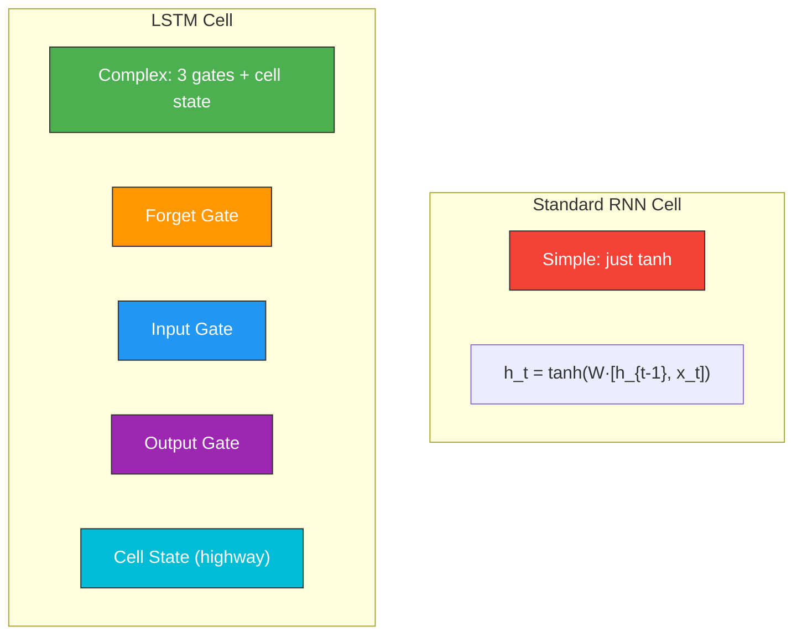

---

## 🔥 The Problem LSTM Solves

### Vanishing Gradient in Standard RNN

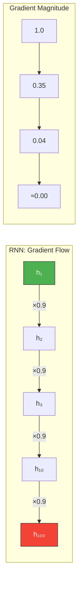

### LSTM Solution: Controlled Gradient Highway

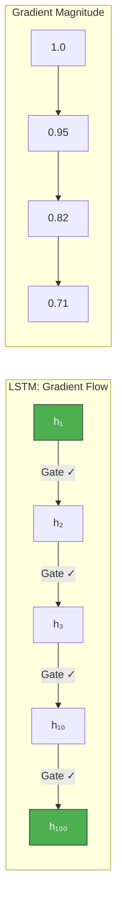

**Key Insight:** The LSTM's cell state acts as a **highway** where gradients can flow unchanged, preventing them from vanishing.

---

## 🏗️ LSTM Architecture — The Big Picture

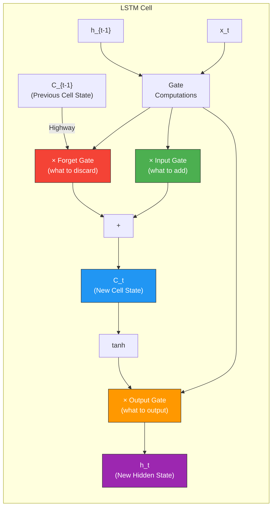

### The Two State Vectors

| State | Purpose | Analogy |
|-------|---------|---------|
| **Cell State ($C_t$)** | Long-term memory | Your notebook — stores important facts |
| **Hidden State ($h_t$)** | Short-term / working memory | Your current thought — what you focus on now |

---

## 🛤️ The Cell State — Information Highway

The cell state runs along the entire chain, with only minor linear interactions. Information can flow along it **unchanged** — this is the key innovation.

```
Cell State = Information Highway
═══════════════════════════════════════════════
                  │                │
            × (Forget)       + (Input)
                  │                │
═══════════════════════════════════════════════
                              │
                         tanh + × (Output)
                              │
                         Hidden State
```

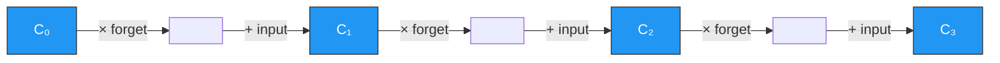

---

## 🚪 Gate 1: Forget Gate

> **"What information from the past should I throw away?"**

$$f_t = \sigma(W_f \cdot [h_{t-1}, x_t] + b_f)$$

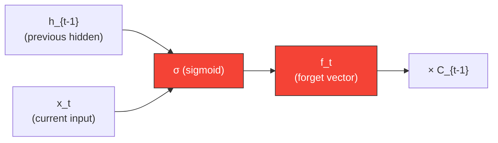

### How It Works

The sigmoid function outputs values between **0 and 1** for each number in the cell state:

```
f_t = 0.0  → COMPLETELY FORGET this information
f_t = 0.5  → PARTIALLY keep this information
f_t = 1.0  → COMPLETELY KEEP this information

Example:
Cell State:  [0.8,  0.3,  0.9,  0.1]  (old memories)
Forget Gate: [1.0,  0.0,  0.7,  1.0]  (which to keep)
Result:      [0.8,  0.0,  0.63, 0.1]  (after forgetting)
              ↑     ↑      ↑     ↑
             kept  forgot  faded  kept
```

### Real-World Analogy

```
Reading a story about a person:
 - "Alice is a doctor." → Remember: Alice=doctor
 - "Alice quit her job." → Forget Gate activates!
   → Forget: Alice=doctor
   → Now Alice's profession slot is empty for new info
```

---

## 🚪 Gate 2: Input Gate

> **"What new information should I store?"**

Two parts:
1. **What to update:** $i_t = \sigma(W_i \cdot [h_{t-1}, x_t] + b_i)$
2. **Candidate values:** $\tilde{C}_t = \tanh(W_C \cdot [h_{t-1}, x_t] + b_C)$

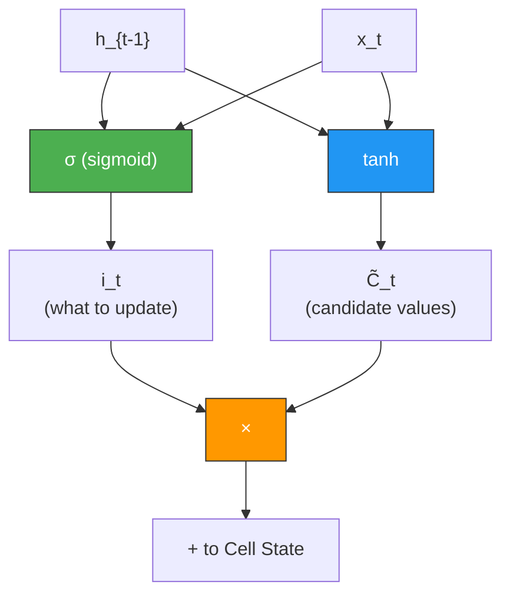

### How It Works

```
Step 1: Decide WHICH positions to update (sigmoid → 0 to 1)
  i_t = [0.1, 0.9, 0.3, 0.8]
         don't  DO  don't  DO
         update     update

Step 2: Create candidate values (tanh → -1 to 1)
  C̃_t = [-0.5, 0.7, 0.2, -0.9]

Step 3: Multiply to get actual update
  i_t × C̃_t = [-0.05, 0.63, 0.06, -0.72]

Step 4: Add to cell state
  C_t = f_t × C_{t-1} + i_t × C̃_t
```

### Updated Cell State

$$C_t = f_t \odot C_{t-1} + i_t \odot \tilde{C}_t$$

Where $\odot$ means element-wise multiplication.

---

## 🚪 Gate 3: Output Gate

> **"What should I output based on the current cell state?"**

$$o_t = \sigma(W_o \cdot [h_{t-1}, x_t] + b_o)$$
$$h_t = o_t \odot \tanh(C_t)$$

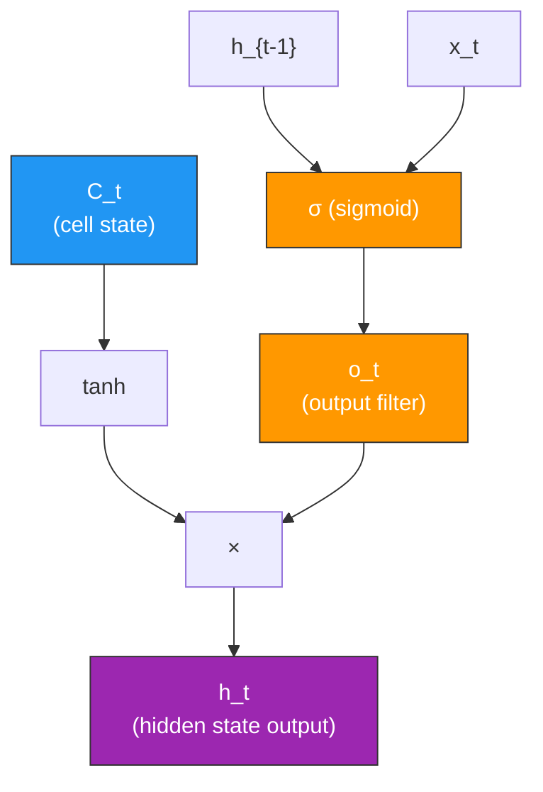

### How It Works

```
Cell State (contains everything we know):
  C_t = [0.8, -0.3, 0.95, 0.1]

Output Gate (what's relevant RIGHT NOW):
  o_t = [1.0, 0.0, 0.5, 0.0]
         yes   no  maybe  no

Hidden State (what we actually output):
  h_t = o_t × tanh(C_t)
      = [1.0, 0.0, 0.5, 0.0] × [0.66, -0.29, 0.74, 0.10]
      = [0.66, 0.0, 0.37, 0.0]

The cell REMEMBERS everything, but only OUTPUTS what's relevant.
```

---

## 📐 Complete LSTM Equations

All four equations in one view:

$$\boxed{f_t = \sigma(W_f \cdot [h_{t-1}, x_t] + b_f)}$$ ← Forget Gate

$$\boxed{i_t = \sigma(W_i \cdot [h_{t-1}, x_t] + b_i)}$$ ← Input Gate

$$\boxed{\tilde{C}_t = \tanh(W_C \cdot [h_{t-1}, x_t] + b_C)}$$ ← Candidate

$$\boxed{C_t = f_t \odot C_{t-1} + i_t \odot \tilde{C}_t}$$ ← Cell State Update

$$\boxed{o_t = \sigma(W_o \cdot [h_{t-1}, x_t] + b_o)}$$ ← Output Gate

$$\boxed{h_t = o_t \odot \tanh(C_t)}$$ ← Hidden State

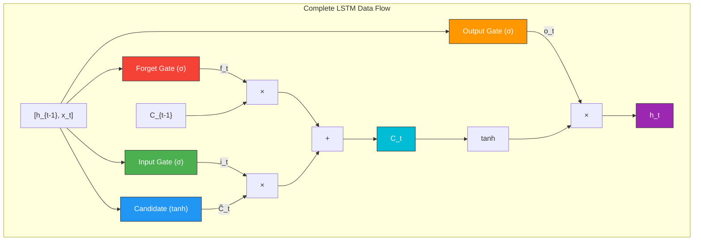

---

## 🚶 Step-by-Step Walkthrough

Let's trace data through an LSTM processing image row features:

```
Time step t=1: Processing Row 1 of image
══════════════════════════════════════════

Inputs:
  x₁ = [0.5, 0.3, 0.8, ...]  (Row 1 pixel values, 96 values)
  h₀ = [0, 0, 0, ...]         (Initialized to zeros)
  C₀ = [0, 0, 0, ...]         (Initialized to zeros)

Step 1 — Forget Gate:
  f₁ = σ(W_f · [h₀, x₁] + b_f)
  f₁ = [0.8, 0.2, 0.9, ...]   (mostly keeping, it's the first step)

Step 2 — Input Gate:
  i₁ = σ(W_i · [h₀, x₁] + b_i)
  i₁ = [0.6, 0.9, 0.4, ...]   (deciding what to store from row 1)
  
  C̃₁ = tanh(W_C · [h₀, x₁] + b_C)
  C̃₁ = [0.3, -0.7, 0.5, ...]  (candidate new information)

Step 3 — Update Cell State:
  C₁ = f₁ ⊙ C₀ + i₁ ⊙ C̃₁
  C₁ = [0.8×0 + 0.6×0.3, 0.2×0 + 0.9×(-0.7), ...]
  C₁ = [0.18, -0.63, ...]

Step 4 — Output Gate:
  o₁ = σ(W_o · [h₀, x₁] + b_o)
  o₁ = [0.7, 0.5, 0.3, ...]
  
  h₁ = o₁ ⊙ tanh(C₁)
  h₁ = [0.7×tanh(0.18), 0.5×tanh(-0.63), ...]
  h₁ = [0.12, -0.27, ...]

→ h₁ and C₁ are passed to the next time step (Row 2)
```

---

## ⚔️ LSTM vs RNN Comparison

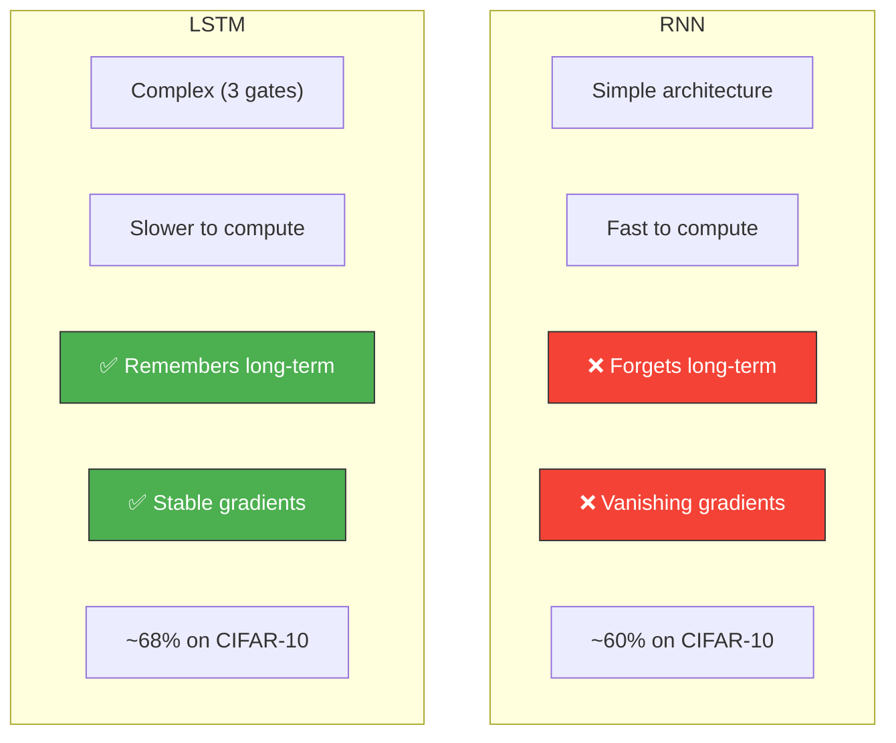

| Feature | RNN | LSTM |
|---------|-----|------|
| **Parameters** | 1 weight matrix | 4 weight matrices (4× more) |
| **Memory** | Single hidden state | Cell state + hidden state |
| **Long sequences** | Fails (>10-20 steps) | Handles 100+ steps |
| **Training speed** | Fast per step | Slower per step |
| **Gradient flow** | Multiplicative (vanishes) | Additive (preserved) |
| **Use cases** | Short sequences | Long sequences, complex patterns |

---

## 🔀 LSTM Variants

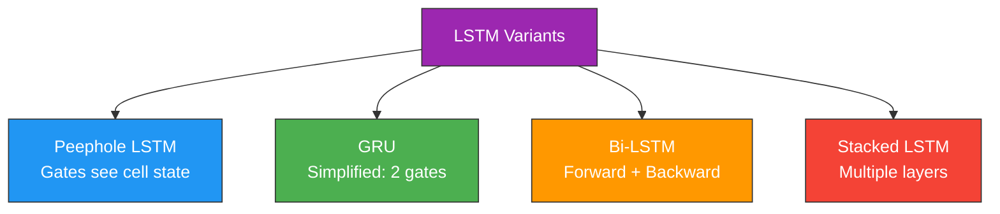

### GRU (Gated Recurrent Unit) — Simplified LSTM

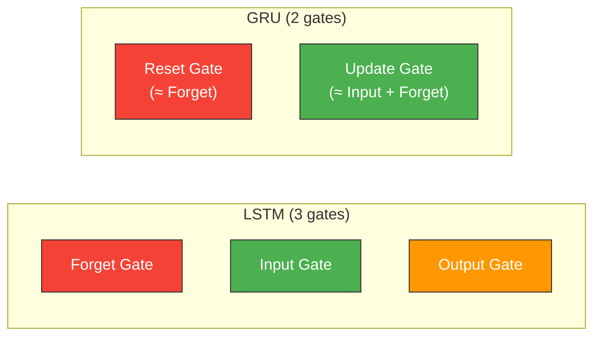

### Bidirectional LSTM

Processes the sequence in **both directions** for richer context:

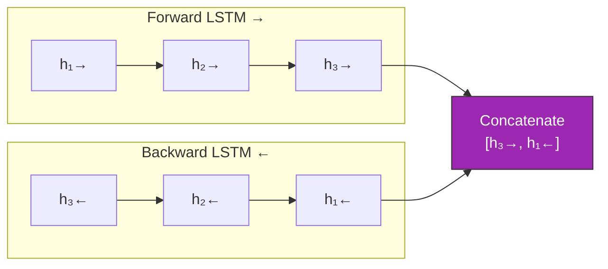

---

## 💻 Our Implementation

Our LSTM model in `src/03_lstm/lstm_model.py`:

- **Input:** CIFAR-10 images as sequences of 32 rows
- **Architecture:** 2-layer LSTM → Fully Connected → 10 classes
- **Key difference from RNN:** Uses LSTM cells with gating mechanisms
- **Expected accuracy:** ~65-70% (better than vanilla RNN)

### Run It

```bash
python src/03_lstm/lstm_model.py
```

### Expected Improvement Over RNN

```
RNN:  ~60-65% accuracy  (forgets early rows)
LSTM: ~65-70% accuracy  (remembers across all 32 rows)

The improvement comes from LSTM's ability to
remember information from Row 1 when processing Row 32.
```

---

## 🔑 Key Takeaways

1. **LSTM** solves the vanishing gradient problem with **gate mechanisms**
2. **Cell state** acts as an information highway for long-term memory
3. **Forget gate** decides what old information to discard
4. **Input gate** decides what new information to store
5. **Output gate** decides what to expose as the current output
6. **LSTM outperforms vanilla RNN** on tasks requiring long-term memory
7. **GRU** is a simpler alternative with comparable performance

---

<div align="center">

**← Previous:** [RNN](03_recurrent_neural_networks.md) | **Next →** [CNN + RNN + LSTM Combined](05_cnn_rnn_lstm_combined.md)

</div>
