# 🔗 Chapter 5 — CNN + RNN + LSTM Combined Architecture

<div align="center">

*"CNN sees the space, LSTM remembers the time — together they understand video."*

</div>

---

## 📑 Table of Contents

1. [Why Combine CNN + LSTM?](#-why-combine-cnn--lstm)
2. [The Combined Architecture](#-the-combined-architecture)
3. [Step-by-Step Data Flow](#-step-by-step-data-flow)
4. [CNN as Feature Extractor](#-cnn-as-feature-extractor)
5. [LSTM as Temporal Modeler](#-lstm-as-temporal-modeler)
6. [Real-World Applications](#-real-world-applications)
7. [Architecture Variations](#-architecture-variations)
8. [Our Implementation](#-our-implementation)
9. [Performance Comparison](#-performance-comparison)

---

## 🤔 Why Combine CNN + LSTM?

Each architecture alone has limitations. Combining them creates a system that understands **both space and time**:

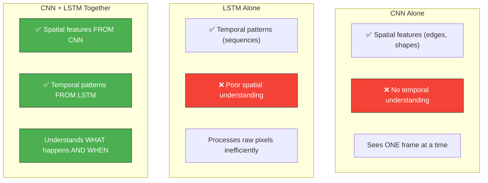

### The Key Insight

> **CNN extracts "what is in each frame"** (spatial features)  
> **LSTM learns "how things change over time"** (temporal patterns)

### Example: Recognizing "Waving" in Video

```
Frame 1: Hand at position A     → CNN sees: hand, left-side
Frame 2: Hand at position B     → CNN sees: hand, center
Frame 3: Hand at position C     → CNN sees: hand, right-side
Frame 4: Hand at position B     → CNN sees: hand, center
Frame 5: Hand at position A     → CNN sees: hand, left-side

LSTM processes the SEQUENCE of CNN features:
→ left → center → right → center → left
→ Pattern detected: WAVING! 👋
```

---

## 🏗️ The Combined Architecture

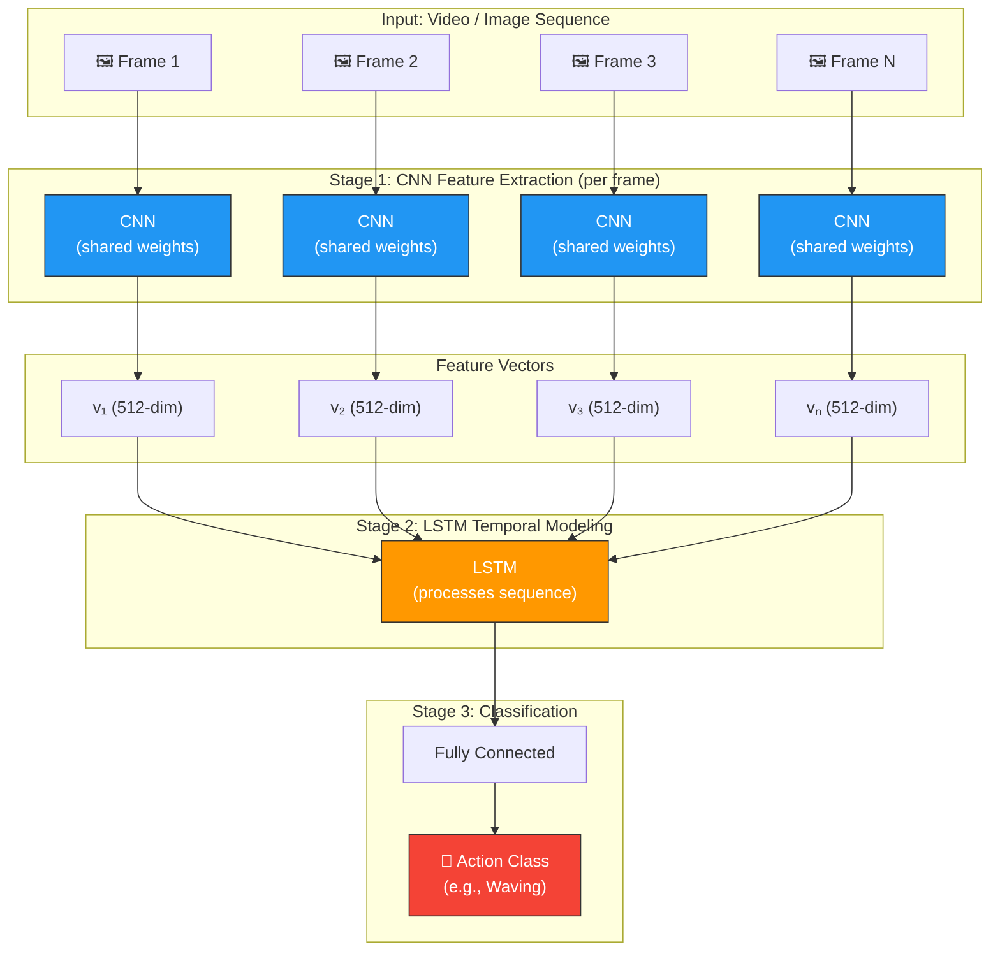

---

## 🔄 Step-by-Step Data Flow

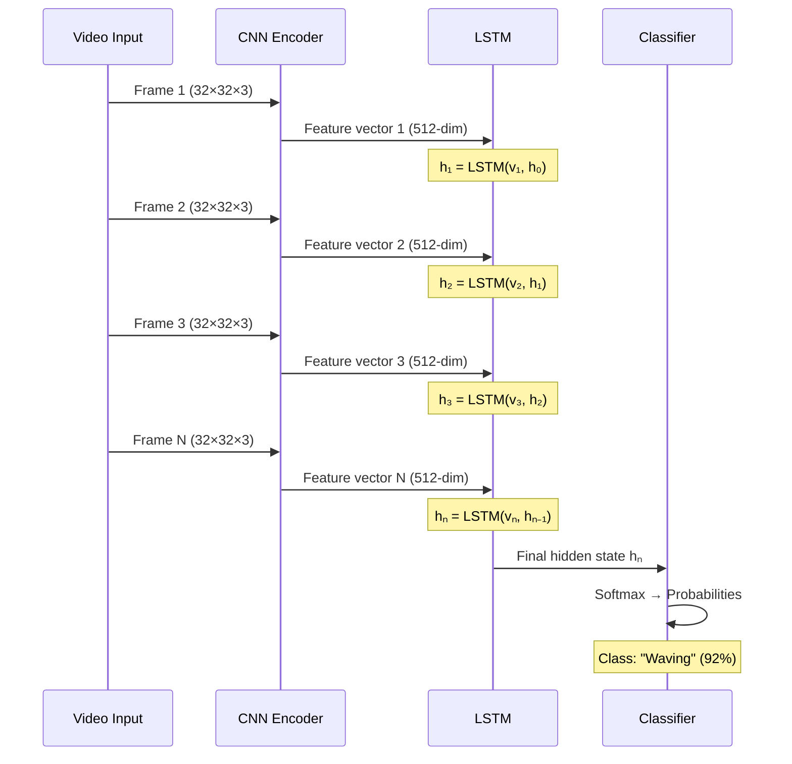

### Dimension Tracking

| Stage | Data | Shape | Description |
|-------|------|-------|-------------|
| Input | Raw frame | `(3, 32, 32)` | RGB image |
| After CNN Conv | Feature maps | `(128, 4, 4)` | Spatial features |
| After CNN Flatten | Feature vector | `(512)` | Compact representation |
| LSTM Input | Sequence | `(N, 512)` | N frames, 512 features each |
| LSTM Output | Hidden state | `(256)` | Temporal summary |
| Final | Prediction | `(10)` | Class probabilities |

---

## 🔍 CNN as Feature Extractor

The CNN's job is to convert raw pixels into meaningful feature vectors. We can use either:

### Option A: Train from Scratch (Our Approach)

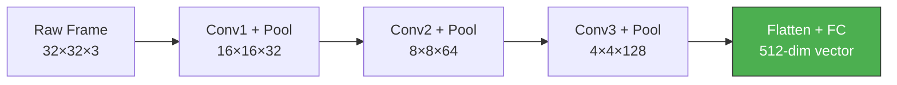

### Option B: Use Pre-trained CNN (Transfer Learning)

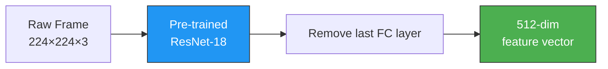

### Why Feature Extraction Works

```
Raw image: 32×32×3 = 3,072 values (mostly noise)
                     ↓ CNN
Feature vector: 512 values (meaningful patterns)

The CNN compresses the image into its ESSENCE:
  - "There's a round shape" (512 dim)
  - vs. raw pixel values (3,072 dim)

This makes the LSTM's job MUCH easier!
```

---

## ⏰ LSTM as Temporal Modeler

The LSTM receives the sequence of CNN feature vectors and learns temporal patterns:

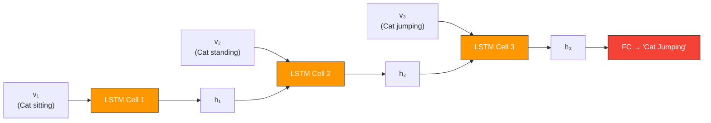

### What the LSTM Learns

- **Frame-to-frame changes:** Motion patterns, transitions
- **Long-range dependencies:** Start vs. end of an action
- **Temporal context:** What happened before affects what's happening now

---

## 🌐 Real-World Applications

### 1. Video Action Recognition

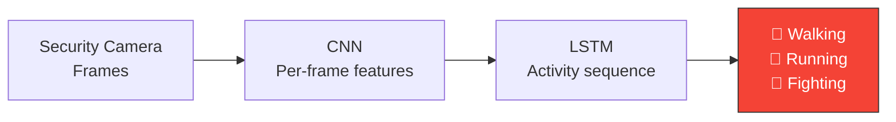

### 2. Medical Video Analysis

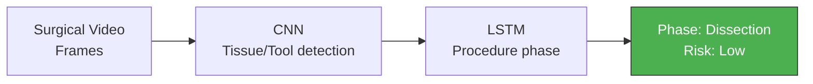

### 3. Self-Driving Cars


### 4. Sign Language Recognition


---

## 🔀 Architecture Variations

### Variation 1: CNN + RNN (Basic)

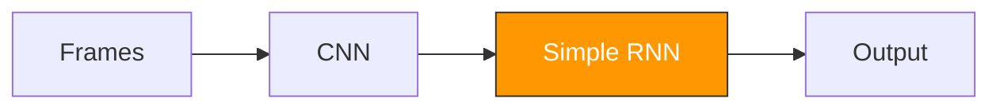
- Simpler but loses long-term info

### Variation 2: CNN + LSTM (Standard)

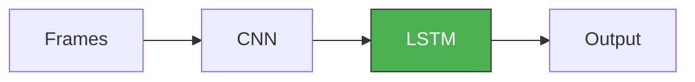
- Best balance of complexity and performance

### Variation 3: CNN + Bi-LSTM (Advanced)

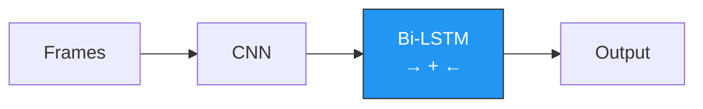
- Bidirectional: sees future and past contexts

### Variation 4: CNN + Attention + LSTM

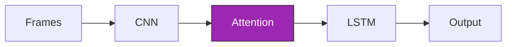
- Attention highlights important frames

---

## 💻 Our Implementation

Our combined model in `src/04_combined/cnn_rnn_lstm_video_classifier.py`:

### Architecture Decision

We simulate video classification by treating CIFAR-10 images as "mini-videos" — splitting each image into frame-like patches:

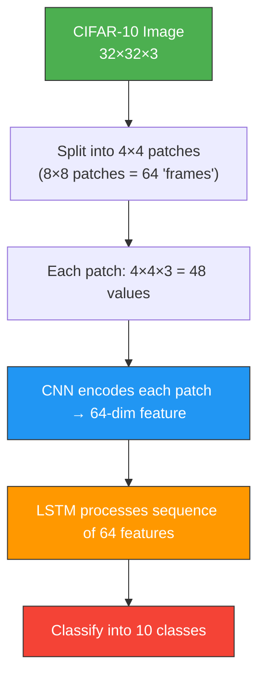

### Model Components

```python
# Pseudo-architecture
class CNN_LSTM_Classifier:
    CNN:
        Conv2d(3, 32) + ReLU + Pool
        Conv2d(32, 64) + ReLU + Pool
        Flatten → 64-dim feature
    
    LSTM:
        LSTM(input=64, hidden=128, layers=2)
    
    Classifier:
        Linear(128, 10)
```

### Run It

```bash
python src/04_combined/cnn_rnn_lstm_video_classifier.py
```

---

## 📊 Performance Comparison

| Model | Architecture | CIFAR-10 Accuracy | Strengths |
|-------|-------------|-------------------|-----------|
| CNN only | 3 Conv + 2 FC | ~75-80% | Best for single images |
| RNN only | 2-layer RNN | ~60-65% | Understands row sequences |
| LSTM only | 2-layer LSTM | ~65-70% | Better long-term memory |
| **CNN + LSTM** | CNN encoder + LSTM | ~70-75% | Spatial + temporal |

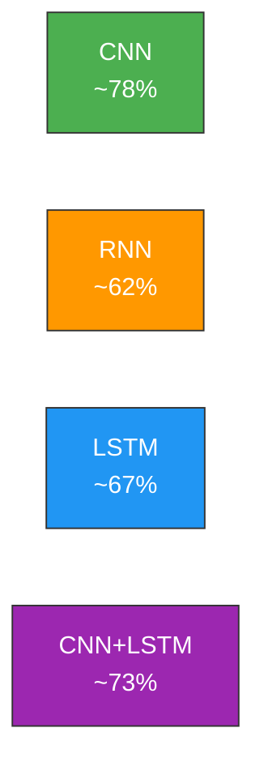

> **Note:** CNN alone scores highest on CIFAR-10 because these are single images, not video. The CNN+LSTM architecture truly shines on **sequential/video data** where temporal understanding is critical.

---

## 🔑 Key Takeaways

1. **CNN + LSTM** combines spatial (CNN) and temporal (LSTM) understanding
2. **CNN extracts features** from each frame → compact representation
3. **LSTM processes the sequence** of features → temporal patterns
4. This architecture is the foundation for **video classification, action recognition**, etc.
5. For single images, CNN alone is sufficient; CNN+LSTM excels on **sequences**
6. Modern alternatives include **Vision Transformers (ViT)** and **Video Transformers**

---

<div align="center">

**← Previous:** [LSTM](04_long_short_term_memory.md) | **Next →** [Azure Deployment Guide](06_azure_deployment_guide.md)

</div>
