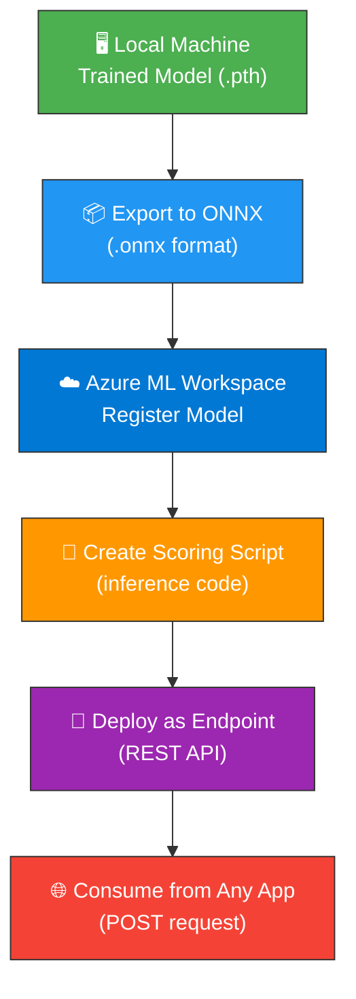
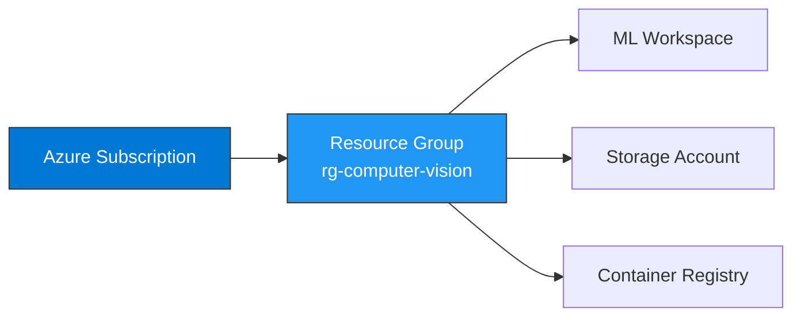
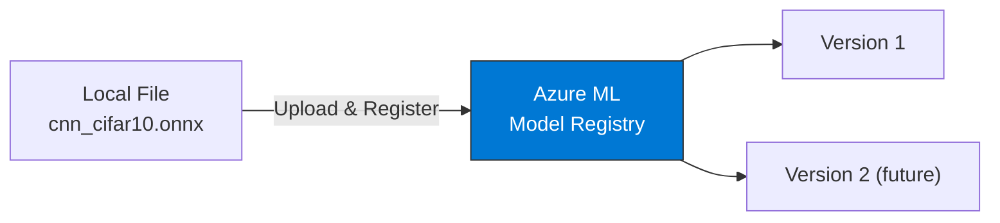
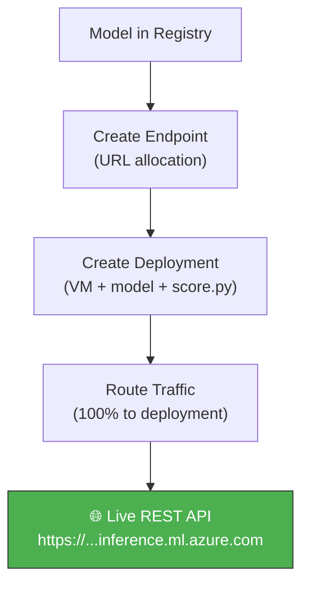
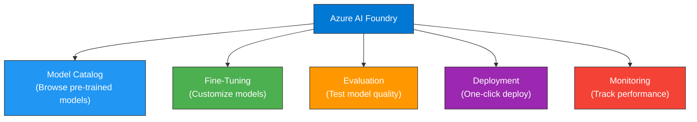
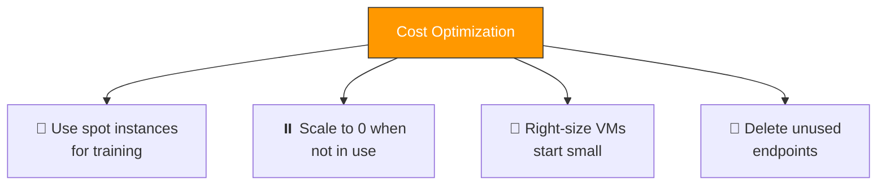

# ☁️ Chapter 6 — Azure & Microsoft Foundry Deployment Guide

<div align="center">

*"Take your model from a local notebook to a production REST API in the cloud."*

</div>

---

## 📑 Table of Contents

1. [Overview — Local to Cloud](#-overview--local-to-cloud)
2. [Prerequisites](#-prerequisites)
3. [Step 1: Export Model to ONNX](#-step-1-export-model-to-onnx)
4. [Step 2: Set Up Azure Account](#-step-2-set-up-azure-account)
5. [Step 3: Create Azure ML Workspace](#-step-3-create-azure-ml-workspace)
6. [Step 4: Register the Model](#-step-4-register-the-model)
7. [Step 5: Create Scoring Script](#-step-5-create-scoring-script)
8. [Step 6: Deploy as REST API](#-step-6-deploy-as-rest-api)
9. [Step 7: Test the Endpoint](#-step-7-test-the-endpoint)
10. [Microsoft Foundry Integration](#-microsoft-foundry-integration)
11. [Cost Management](#-cost-management)
12. [Troubleshooting](#-troubleshooting)

---

## 🗺️ Overview — Local to Cloud



---

## ✅ Prerequisites

Before starting, ensure you have:

| Requirement | How to Get |
|-------------|-----------|
| **Azure Account** | [Free account with $200 credit](https://azure.microsoft.com/free/) |
| **Azure CLI** | `pip install azure-cli` or [download](https://learn.microsoft.com/cli/azure/install-azure-cli) |
| **Python packages** | Already in `requirements.txt` (azure-ai-ml, azure-identity) |
| **Trained model** | Run any of the training scripts first |

---

## 📦 Step 1: Export Model to ONNX

ONNX (Open Neural Network Exchange) is the universal model format that works with Azure ML.

### Export Script

Create a file or run the following after training your CNN model:

```python
"""
export_to_onnx.py
Exports the trained PyTorch CNN model to ONNX format for cloud deployment.
"""
import torch
import torch.onnx

# ── Step 1: Load the trained model ──────────────────────
# Import the CNN class from our training script
from src.01_cnn.cnn_image_classifier import CNNClassifier

# Create model instance and load trained weights
model = CNNClassifier()
model.load_state_dict(torch.load("models/cnn_cifar10.pth", map_location="cpu"))
model.eval()  # Set to evaluation mode (disables dropout, etc.)

# ── Step 2: Create a dummy input matching model's expected shape ──
# CIFAR-10: batch_size=1, channels=3, height=32, width=32
dummy_input = torch.randn(1, 3, 32, 32)

# ── Step 3: Export to ONNX ─────────────────────────────
torch.onnx.export(
    model,                     # The trained model
    dummy_input,               # Example input tensor
    "models/cnn_cifar10.onnx", # Output file path
    input_names=["image"],     # Name for the input layer
    output_names=["prediction"],  # Name for the output layer
    dynamic_axes={             # Allow variable batch size
        "image": {0: "batch_size"},
        "prediction": {0: "batch_size"}
    },
    opset_version=17           # ONNX operation set version
)

print("✅ Model exported to models/cnn_cifar10.onnx")
```

### Verify the Export

```python
import onnxruntime as ort
import numpy as np

# Load ONNX model
session = ort.InferenceSession("models/cnn_cifar10.onnx")

# Run inference with random input
test_input = np.random.randn(1, 3, 32, 32).astype(np.float32)
result = session.run(None, {"image": test_input})
print(f"Output shape: {result[0].shape}")  # Should be (1, 10)
print("✅ ONNX model verification passed!")
```

---

## 🔑 Step 2: Set Up Azure Account

### 2.1 — Login to Azure

```bash
# Login via browser (opens a browser window)
az login

# Verify your subscription
az account show --output table
```

### 2.2 — Create a Resource Group

```bash
# Create a resource group to hold all project resources
az group create \
    --name rg-computer-vision \
    --location eastus
```



---

## 🏢 Step 3: Create Azure ML Workspace

### Using Azure CLI

```bash
# Install the ML extension
az extension add -n ml -y

# Create the workspace (this also creates storage, key vault, etc.)
az ml workspace create \
    --name mlw-computer-vision \
    --resource-group rg-computer-vision \
    --location eastus
```

### Using Python SDK

```python
"""
setup_azure_workspace.py
Creates an Azure ML workspace programmatically.
"""
from azure.ai.ml import MLClient
from azure.ai.ml.entities import Workspace
from azure.identity import DefaultAzureCredential

# ── Authenticate with Azure ─────────────────────────────
# DefaultAzureCredential tries multiple auth methods:
# 1. Environment variables  2. Managed identity
# 3. Azure CLI login        4. VS Code login
credential = DefaultAzureCredential()

# ── Create ML Client ────────────────────────────────────
ml_client = MLClient(
    credential=credential,
    subscription_id="<your-subscription-id>",  # Replace with yours
    resource_group_name="rg-computer-vision"
)

# ── Create Workspace ────────────────────────────────────
workspace = Workspace(
    name="mlw-computer-vision",
    location="eastus",
    display_name="Computer Vision Project",
    description="CNN + RNN + LSTM models for computer vision"
)

# This will create the workspace and associated resources
ml_client.workspaces.begin_create(workspace).result()
print("✅ Workspace created successfully!")
```

---

## 📋 Step 4: Register the Model

Register your ONNX model in Azure ML so it can be deployed:

```python
"""
register_model.py
Registers the exported ONNX model in Azure ML.
"""
from azure.ai.ml import MLClient
from azure.ai.ml.entities import Model
from azure.ai.ml.constants import AssetTypes
from azure.identity import DefaultAzureCredential

# ── Connect to workspace ────────────────────────────────
credential = DefaultAzureCredential()
ml_client = MLClient(
    credential=credential,
    subscription_id="<your-subscription-id>",
    resource_group_name="rg-computer-vision",
    workspace_name="mlw-computer-vision"
)

# ── Register the model ──────────────────────────────────
model = Model(
    path="models/cnn_cifar10.onnx",        # Local path to model file
    name="cnn-cifar10-classifier",          # Name in Azure ML registry
    description="CNN classifier for CIFAR-10 (10 classes)",
    type=AssetTypes.CUSTOM_MODEL            # Generic model type
)

registered_model = ml_client.models.create_or_update(model)
print(f"✅ Model registered: {registered_model.name}, version: {registered_model.version}")
```



---

## 🔧 Step 5: Create Scoring Script

The scoring script defines how your model handles incoming requests:

```python
"""
score.py
Azure ML scoring script — handles inference requests.
This file runs inside the deployed container on Azure.
"""
import json
import numpy as np
import onnxruntime as ort
import os

# ── CIFAR-10 class names ────────────────────────────────
CLASSES = [
    "airplane", "automobile", "bird", "cat", "deer",
    "dog", "frog", "horse", "ship", "truck"
]

def init():
    """
    Called ONCE when the endpoint starts up.
    Loads the ONNX model into memory.
    """
    global session
    # AZUREML_MODEL_DIR contains the registered model path
    model_path = os.path.join(
        os.getenv("AZUREML_MODEL_DIR"), "cnn_cifar10.onnx"
    )
    session = ort.InferenceSession(model_path)
    print("✅ Model loaded successfully")


def run(raw_data):
    """
    Called for EVERY inference request.
    Receives JSON with image data, returns predicted class.
    """
    try:
        # Parse incoming JSON data
        data = json.loads(raw_data)
        
        # Convert to numpy array: shape (batch, 3, 32, 32)
        input_array = np.array(data["image"], dtype=np.float32)
        
        # Run inference through the ONNX model
        result = session.run(None, {"image": input_array})
        
        # Get predicted class index
        predictions = result[0]
        predicted_idx = int(np.argmax(predictions, axis=1)[0])
        confidence = float(np.max(predictions))

        return json.dumps({
            "predicted_class": CLASSES[predicted_idx],
            "class_index": predicted_idx,
            "confidence": confidence,
            "all_probabilities": {
                CLASSES[i]: float(predictions[0][i])
                for i in range(10)
            }
        })

    except Exception as e:
        return json.dumps({"error": str(e)})
```

---

## 🚀 Step 6: Deploy as REST API

### Create a Managed Online Endpoint

```python
"""
deploy_endpoint.py
Deploys the registered model as a managed online endpoint.
"""
from azure.ai.ml import MLClient
from azure.ai.ml.entities import (
    ManagedOnlineEndpoint,
    ManagedOnlineDeployment,
    CodeConfiguration,
    Environment,
)
from azure.identity import DefaultAzureCredential

# ── Connect to workspace ────────────────────────────────
credential = DefaultAzureCredential()
ml_client = MLClient(
    credential=credential,
    subscription_id="<your-subscription-id>",
    resource_group_name="rg-computer-vision",
    workspace_name="mlw-computer-vision"
)

# ── Step 1: Create Endpoint ─────────────────────────────
endpoint = ManagedOnlineEndpoint(
    name="cv-classifier-endpoint",
    description="CIFAR-10 Image Classifier API",
    auth_mode="key"  # API key authentication
)
ml_client.online_endpoints.begin_create_or_update(endpoint).result()
print("✅ Endpoint created")

# ── Step 2: Create Deployment ───────────────────────────
deployment = ManagedOnlineDeployment(
    name="cnn-deploy-v1",
    endpoint_name="cv-classifier-endpoint",
    model="cnn-cifar10-classifier:1",  # model_name:version
    code_configuration=CodeConfiguration(
        code="./deploy",         # Folder with score.py
        scoring_script="score.py"
    ),
    environment=Environment(
        image="mcr.microsoft.com/azureml/openmpi4.1.0-ubuntu20.04",
        conda_file="deploy/conda.yml"
    ),
    instance_type="Standard_DS2_v2",  # VM size
    instance_count=1
)
ml_client.online_deployments.begin_create_or_update(deployment).result()

# ── Step 3: Route 100% traffic to this deployment ──────
endpoint.traffic = {"cnn-deploy-v1": 100}
ml_client.online_endpoints.begin_create_or_update(endpoint).result()
print("✅ Deployment complete! Endpoint is live.")

# ── Get endpoint URL and key ────────────────────────────
endpoint = ml_client.online_endpoints.get("cv-classifier-endpoint")
keys = ml_client.online_endpoints.get_keys("cv-classifier-endpoint")
print(f"📡 Endpoint URL: {endpoint.scoring_uri}")
print(f"🔑 API Key: {keys.primary_key}")
```



---

## 🧪 Step 7: Test the Endpoint

### Using Python

```python
"""
test_endpoint.py
Send a test image to the deployed Azure ML endpoint.
"""
import requests
import json
import numpy as np

# ── Endpoint details (from Step 6 output) ───────────────
ENDPOINT_URL = "https://cv-classifier-endpoint.eastus.inference.ml.azure.com/score"
API_KEY = "<your-api-key>"

# ── Prepare a test image (random for demo) ──────────────
# In production, load and preprocess a real image
test_image = np.random.randn(1, 3, 32, 32).tolist()

# ── Send request ────────────────────────────────────────
response = requests.post(
    ENDPOINT_URL,
    json={"image": test_image},
    headers={
        "Content-Type": "application/json",
        "Authorization": f"Bearer {API_KEY}"
    }
)

# ── Print result ────────────────────────────────────────
result = response.json()
print(f"Predicted class: {result['predicted_class']}")
print(f"Confidence: {result['confidence']:.2%}")
```

### Using cURL

```bash
curl -X POST "https://cv-classifier-endpoint.eastus.inference.ml.azure.com/score" \
    -H "Content-Type: application/json" \
    -H "Authorization: Bearer <your-api-key>" \
    -d '{"image": [[[...]]]}'
```

---

## 🏭 Microsoft Foundry Integration

Microsoft Azure AI Foundry (formerly Azure AI Studio) provides a unified platform for building, evaluating, and deploying AI models.



### Step-by-Step Foundry Usage

1. **Navigate to Azure AI Foundry**: Go to [ai.azure.com](https://ai.azure.com)

2. **Create a Project**:
   - Click "New project"
   - Select your subscription and resource group
   - Name it: "computer-vision-project"

3. **Upload Your Model**:
   - Go to "Models + Endpoints" → "Register a model"
   - Upload your `cnn_cifar10.onnx` file
   - Add metadata (task type: image classification)

4. **Deploy from Foundry**:
   - Select your registered model
   - Click "Deploy" → "Real-time endpoint"
   - Configure compute (Standard_DS2_v2 recommended)
   - Deploy!

5. **Test in Playground**:
   - Use the built-in inference playground
   - Upload test images directly in the browser
   - See predictions instantly

### Azure AI Foundry CLI (Optional)

```bash
# Install the AI Foundry extension
az extension add -n ai

# Create a Foundry project
az ai project create \
    --name computer-vision-project \
    --resource-group rg-computer-vision \
    --location eastus
```

---

## 💰 Cost Management

### Estimated Costs

| Resource | SKU | Cost/Month (approx.) |
|----------|-----|---------------------|
| ML Workspace | — | Free |
| Compute (endpoint) | Standard_DS2_v2 | ~$100/month |
| Storage | Standard | ~$2/month |
| Container Registry | Basic | ~$5/month |

### Cost Saving Tips



```bash
# Delete endpoint when not needed (stops billing)
az ml online-endpoint delete \
    --name cv-classifier-endpoint \
    --resource-group rg-computer-vision \
    --workspace-name mlw-computer-vision \
    --yes

# Clean up everything
az group delete --name rg-computer-vision --yes
```

---

## 🔧 Troubleshooting

| Issue | Solution |
|-------|----------|
| `AuthenticationError` | Run `az login` again |
| `ResourceNotFoundError` | Check resource group and workspace names |
| Deployment stuck at "Creating" | Check logs: `az ml online-deployment get-logs` |
| Endpoint returns 500 | Check `score.py` for errors — test locally first |
| High latency | Use a closer Azure region or larger VM |

### Check Deployment Logs

```bash
az ml online-deployment get-logs \
    --name cnn-deploy-v1 \
    --endpoint-name cv-classifier-endpoint \
    --resource-group rg-computer-vision \
    --workspace-name mlw-computer-vision
```

---

## 🔑 Key Takeaways

1. Export your model to **ONNX** for cross-platform compatibility
2. Azure ML provides a managed **end-to-end MLOps** pipeline
3. **Managed online endpoints** handle scaling, load balancing, and monitoring
4. **Azure AI Foundry** offers a GUI-based alternative to CLI/SDK
5. Always **delete unused endpoints** to avoid unexpected charges
6. Use **API keys** or **Azure AD** tokens for endpoint authentication

---

<div align="center">

**← Previous:** [CNN + RNN + LSTM Combined](05_cnn_rnn_lstm_combined.md) | **Next →** [LinkedIn Publishing Guide](07_linkedin_publishing_guide.md)

</div>

---

## Deep-Dive Operations Pack

### Deployment Readiness Checklist
- Model file exists and loads locally.
- ONNX export validated with local inference.
- Azure subscription, resource group, and workspace are confirmed.
- Endpoint auth and test payload are documented.

### Validation Workflow
1. Test model locally before cloud registration.
2. Validate endpoint with a known sample payload.
3. Track latency, failures, and cost after deployment.

### Production Hardening Notes
- Add input schema validation in scoring code.
- Log request IDs and model version for traceability.
- Configure alerts for failure rate and latency spikes.
- Always keep rollback path to previous model version.

### Assignment
- Deploy one model version, test it, then deploy a second version and document blue/green or rollback strategy.
