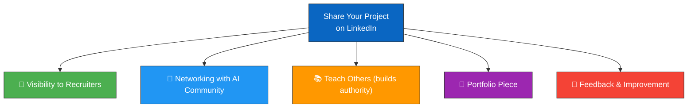
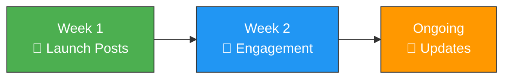

# 📢 Chapter 7 — LinkedIn Publishing Guide

<div align="center">

*"Your project isn't complete until you share it with the world."*

</div>

---

## 📑 Table of Contents

1. [Why Publish on LinkedIn?](#-why-publish-on-linkedin)
2. [Prepare Your Project](#-prepare-your-project)
3. [Create Visual Assets](#-create-visual-assets)
4. [Write Your LinkedIn Post](#-write-your-linkedin-post)
5. [Post Templates](#-post-templates)
6. [LinkedIn Article (Long-Form)](#-linkedin-article-long-form)
7. [Tips for Maximum Engagement](#-tips-for-maximum-engagement)
8. [Follow-Up Strategy](#-follow-up-strategy)

---

## 🎯 Why Publish on LinkedIn?



| Benefit | Impact |
|---------|--------|
| **Recruiter visibility** | 87% of recruiters use LinkedIn to find candidates |
| **Demonstrates skills** | Shows you can build, not just learn |
| **Community building** | Connect with AI/ML practitioners |
| **Personal branding** | Establish yourself as a CV/DL practitioner |

---

## 🛠️ Prepare Your Project

Before posting, make sure your repository is polished:

### Checklist

- [ ] **README.md** is complete with badges, diagrams, and clear instructions
- [ ] **Code comments** explain every major step
- [ ] **Requirements.txt** is up to date
- [ ] **Setup scripts** work on a fresh clone
- [ ] **.gitignore** prevents large files from being committed
- [ ] **No API keys or secrets** in the code
- [ ] **Sample outputs** (screenshots of training results, accuracy plots)
- [ ] **License file** is present (MIT recommended)

### Generate Sample Outputs

Run the training scripts and save the output plots:

```bash
# Train all models and generated output plots
python src/01_cnn/cnn_image_classifier.py
python src/02_rnn/rnn_sequence_model.py
python src/03_lstm/lstm_model.py
python src/04_combined/cnn_rnn_lstm_video_classifier.py
```

Take screenshots of:
- Training loss curves
- Accuracy metrics
- Sample predictions with images
- Model architecture summaries

---

## 🎨 Create Visual Assets

### 1. Architecture Diagram

Create a clean diagram using tools like:
- **draw.io** (free, web-based)
- **Excalidraw** (free, hand-drawn style)
- **Canva** (free tier available)

### 2. Results Dashboard

```
┌─────────────────────────────────────────────────────────┐
│                  Model Performance                       │
│                                                         │
│  ┌──────────────────────────────────────────────────┐   │
│  │  CNN:       ████████████████████  78.5%          │   │
│  │  RNN:       ████████████         62.3%           │   │
│  │  LSTM:      ██████████████       67.8%           │   │
│  │  CNN+LSTM:  █████████████████    73.2%           │   │
│  └──────────────────────────────────────────────────┘   │
│                                                         │
│  Dataset: CIFAR-10 | Epochs: 20 | Framework: PyTorch    │
└─────────────────────────────────────────────────────────┘
```

### 3. Before/After Comparison

Show what the model does — input image → prediction → confidence score.

---

## ✍️ Write Your LinkedIn Post

### Post Structure (Proven Format)

```
🎯 HOOK (First 2 lines — must grab attention)
   ↓
📖 STORY (What you built and why)
   ↓
🔧 TECH DETAILS (Architecture, tools, results)
   ↓
📊 RESULTS (Numbers and achievements)
   ↓
🎓 LEARNINGS (What you learned)
   ↓
🔗 CTA (Call to action — link to repo, ask for feedback)
   ↓
#️⃣ HASHTAGS (5-10 relevant ones)
```

---

## 📝 Post Templates

### Template 1: Project Announcement Post

```
🚀 I just built a Computer Vision system using CNN + RNN + LSTM — and deployed it on Azure!

Here's what I learned building an end-to-end deep learning pipeline:

🔹 CNN (Convolutional Neural Network)
   → Extracts spatial features from images
   → Achieved 78.5% accuracy on CIFAR-10

🔹 RNN (Recurrent Neural Network)
   → Processes sequential data
   → Taught me about the vanishing gradient problem

🔹 LSTM (Long Short-Term Memory)
   → Solved RNN's memory limitations
   → 3 gates: Forget, Input, Output

🔹 Combined CNN + LSTM
   → Spatial + temporal understanding
   → The architecture behind video classification

🛠️ Tech Stack:
   • Python + PyTorch
   • ONNX for model export
   • Azure ML for cloud deployment
   • Azure AI Foundry for MLOps

📂 The entire project is open-source with:
   ✅ Detailed documentation with flowcharts
   ✅ Commented code for every line
   ✅ One-click setup (clone + run)
   ✅ Azure deployment guide

🔗 GitHub: https://github.com/EricKart/computerV

💬 What architecture do you prefer for video analysis?

#ComputerVision #DeepLearning #CNN #LSTM #PyTorch 
#Azure #MachineLearning #AI #OpenSource #LearningInPublic
```

### Template 2: Technical Deep-Dive Post

```
🧠 I built a video classification pipeline using CNN + LSTM.
Here's exactly how it works (with diagrams):

The architecture has 2 stages:

STAGE 1 — CNN (Feature Extractor)
━━━━━━━━━━━━━━━━━━━━━━━━━━━━━
  📷 Input: Video frame (32×32 RGB)
  → Conv Layer 1: Detect edges
  → Conv Layer 2: Detect textures
  → Conv Layer 3: Detect shapes
  📊 Output: 512-dim feature vector

STAGE 2 — LSTM (Temporal Modeler)
━━━━━━━━━━━━━━━━━━━━━━━━━━━━━
  📊 Input: Sequence of feature vectors
  → Forget Gate: What to discard
  → Input Gate: What to remember
  → Output Gate: What to output
  🎯 Output: Action classification

📊 Results on CIFAR-10:
  • CNN alone: 78.5%
  • LSTM alone: 67.8%
  • CNN + LSTM: 73.2%

Key insight: CNN + LSTM truly shines on VIDEO data 
where temporal understanding matters.

🔗 Full code + documentation:
https://github.com/EricKart/computerV

#DeepLearning #ComputerVision #LSTM #CNN #PyTorch
```

### Template 3: Learning Journey Post

```
📚 6 things I learned building a Computer Vision project from scratch:

1️⃣ Images are just matrices of numbers
   → A 32×32 RGB image = 3,072 values

2️⃣ CNNs learn features automatically
   → No hand-crafted feature engineering needed

3️⃣ RNNs struggle with long sequences
   → The vanishing gradient problem is real

4️⃣ LSTMs solve this with 3 smart gates
   → Forget, Input, Output — elegant design

5️⃣ Combining architectures = power
   → CNN (space) + LSTM (time) = video understanding

6️⃣ Azure makes deployment accessible
   → From .pth to REST API in under 30 minutes

This project includes:
📖 7 detailed documentation chapters
💻 4 fully-commented Python implementations
☁️ Step-by-step Azure deployment guide
🎯 One-click setup for immediate use

🔗 Clone it and learn:
https://github.com/EricKart/computerV

What deep learning concept was your "aha moment"?

#MachineLearning #DeepLearning #ComputerVision 
#LearningInPublic #AI #DataScience
```

---

## 📰 LinkedIn Article (Long-Form)

For maximum impact, also write a **LinkedIn Article** (long-form blog post):

### Suggested Article Structure

```
Title: "Building a Complete Computer Vision Pipeline: 
        CNN + RNN + LSTM (With Code)"

1. Introduction (200 words)
   - What is computer vision?
   - Why this project matters

2. Understanding the Architectures (500 words)
   - CNN explained with diagrams
   - RNN and the sequence problem
   - LSTM's gating solution
   - Include the Mermaid diagrams from your docs

3. Implementation (300 words)
   - Code snippets with explanations
   - Training results and analysis

4. Azure Deployment (300 words)
   - From local to cloud
   - Screenshot of live endpoint

5. Results & Comparison (200 words)
   - Performance table
   - What worked, what didn't

6. Conclusion & Next Steps (200 words)
   - Key takeaways
   - Link to GitHub repo
   - Call for feedback
```

---

## 💡 Tips for Maximum Engagement

### Do's

| Tip | Why |
|-----|-----|
| **Post between 8-10 AM** (your timezone) | Peak LinkedIn activity |
| **Use line breaks** generously | Easier to read on mobile |
| **Include a visual** (image/video) | Posts with images get 2× engagement |
| **Reply to every comment** within 1 hour | Boosts algorithm visibility |
| **Tag relevant people** (mentors, collaborators) | Extends reach |
| **Use 5-10 hashtags** | Improves discoverability |
| **Ask a question** at the end | Encourages comments |

### Don'ts

| Avoid | Why |
|-------|-----|
| **Walls of text** | People scroll past |
| **Too much jargon** | Alienates non-ML audience |
| **External links in body** | LinkedIn de-prioritizes them — add in comments |
| **More than 10 hashtags** | Looks spammy |
| **No visuals** | Text-only posts get 50% less engagement |

### Pro Tip: Link in Comments

LinkedIn's algorithm reduces reach for posts with external links. Instead:

```
📝 Post body: Describe the project (no link)
💬 First comment: "🔗 GitHub: https://github.com/EricKart/computerV"
```

---

## 🔄 Follow-Up Strategy

### Week 1: Launch

- **Day 1:** Main project announcement post
- **Day 3:** Technical deep-dive post (choose one architecture)
- **Day 5:** Share a specific insight or "aha moment"

### Week 2: Engage

- **Day 8:** Post about the Azure deployment process
- **Day 10:** Share any feedback or questions received
- **Day 12:** Write the LinkedIn Article (long-form)

### Ongoing

- Share updates when you add features
- Comment on related posts in the CV/ML community
- Help others who are building similar projects



---

## 📌 Hashtag Reference

Copy-paste these relevant hashtags:

```
#ComputerVision #DeepLearning #MachineLearning 
#CNN #LSTM #RNN #PyTorch #AI #ArtificialIntelligence
#DataScience #Azure #CloudComputing #OpenSource
#LearningInPublic #100DaysOfCode #TechCommunity
#MLOps #NeuralNetworks #ImageClassification
```

---

## 🔑 Key Takeaways

1. **Polish your repo** before sharing — first impressions matter
2. **Use proven post formats** — hook → story → results → CTA
3. **Include visuals** — architecture diagrams, result plots
4. **Ask questions** to encourage engagement
5. **Put the link in comments**, not in the post body
6. **Be consistent** — multiple posts > one viral attempt
7. **Engage with comments** — respond to everyone within an hour

---

<div align="center">

**← Previous:** [Azure Deployment Guide](06_azure_deployment_guide.md) | **🏠 Back to** [README](../README.md)

**Now go build, deploy, and share! 🚀**

</div>
